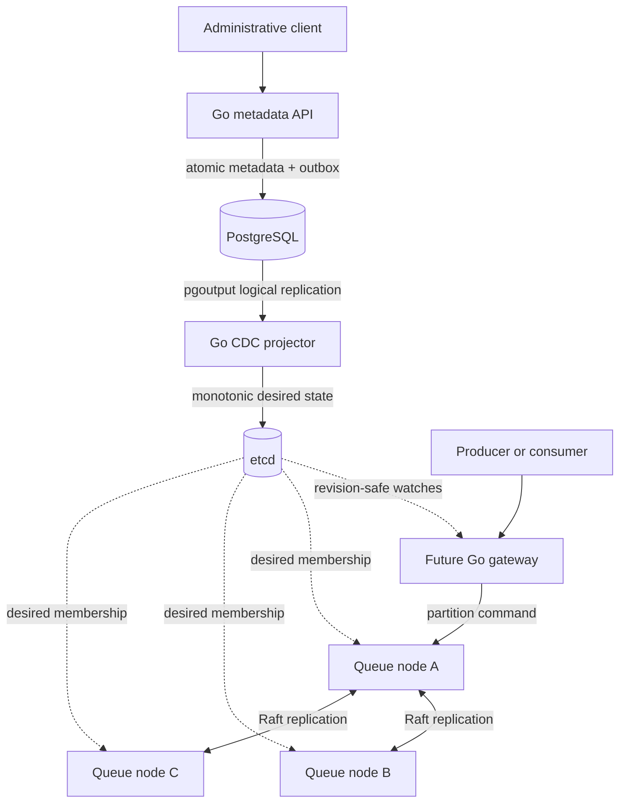
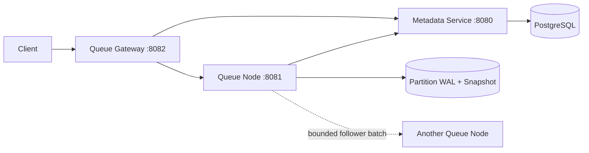

# Distributed Queue

A durable queue built incrementally to study the correctness mechanisms behind
distributed systems: state machines, leases, write-ahead logging, snapshots,
fencing, routing, replication, consensus, and failure recovery. The existing
Java 21 system remains the semantic and storage baseline while the target
multi-Raft architecture is implemented in Go.

This is a learning and architecture project, not a production-ready message
broker or an attempt to copy every feature of an existing queue.

## Project status

**Latest release:** v0.29.0 — immutable initial replica membership and
placement, plus the first Go target-runtime foundation.

**Target architecture implementation:** Go control-plane and deterministic
data-plane foundations. PostgreSQL commits queue metadata and an append-only
outbox atomically; a logical-replication projector publishes monotonic desired
state to etcd without polling. The first Dragonboat v4 dependency gate is
complete and deferred. Multi-Raft queue integration now exists only in an
isolated experimental module; it is not part of the production runtime.

The [v0.29 HLD](docs/design/v0.29-replica-membership-hld.md),
[LLD](docs/design/v0.29-replica-membership-lld.md), and
[ADR 0028](docs/adr/0028-immutable-initial-replica-membership.md) define a
complete, durable replica set before automatic replication is introduced.

## What works today

### Java baseline

- FIFO publication within one local partition;
- receipt-handle ACK and NACK;
- finite delivery leases, redelivery, retry limits, delayed retry, and DLQ;
- retained-message and retained-byte admission limits;
- WAL-first durable state transitions with CRC32C-protected frames;
- persisted leases and restart recovery;
- snapshots plus retained WAL suffix recovery;
- segmented WAL rotation and snapshot-authorized reclamation;
- durable queue/generation/partition lineage validation;
- PostgreSQL-backed tenant queue metadata;
- lease-fenced provisioning and runtime activation;
- stable customer routing through the queue gateway;
- epoch-fenced, ordered follower WAL storage;
- bounded follower HTTP batches and resumable one-cycle catch-up;
- durable logical index and term in segmented-WAL frames;
- one-force follower durability groups and replica hard state;
- snapshot logical boundaries that survive reclaimed WAL prefixes;
- configurable replica factor with a default of three;
- atomic, distinct-node replica placement with deterministic load tie-breaking;
- per-replica fenced provisioning and inspectable desired assignments;
- activation only after every initial replica has materialized local storage.

### Go target-architecture foundation

- deterministic partition command application with lineage and schema checks;
- publish, claim, ACK, NACK, lease expiry, delayed delivery, and DLQ transitions;
- bounded producer deduplication and command-result replay;
- deterministic snapshots with logical index and term boundaries;
- project-owned consensus port plus an explicitly non-distributed local adapter;
- atomic PostgreSQL queue, idempotency, and outbox transactions;
- append-only outbox enforcement in PostgreSQL;
- PostgreSQL logical replication to version-monotonic etcd projections;
- rack-aware initial placement policy;
- deployable Go metadata API and coordination projector containers.

### Experimental consensus evidence

- isolated, exactly pinned Dragonboat v4 proof module;
- real three-replica leader election and deterministic apply result;
- rejection of proposals after quorum loss;
- local snapshot, close, restart, and state restoration proof;
- checked-in three-sample synchronous proposal benchmark;
- experimental Dragonboat adapter for the real deterministic queue state
  machine behind `consensus.Group`;
- runnable three-node queue cluster with publish, receive, ACK, and NACK;
- tested majority loss, leader failover, idempotent ambiguous retry, and
  snapshot-plus-log restart.

This evidence does not make Dragonboat a production dependency. The evaluated
v4 line is still development code and is deferred by
[ADR 0031](docs/adr/0031-defer-dragonboat-v4.md). The G2 implementation remains
isolated under that boundary by
[ADR 0032](docs/adr/0032-experimental-g2-replicated-partition.md).

## What is not guaranteed yet

- no automatic replication scheduler or follower catch-up loop;
- no production-approved majority-quorum acknowledgement;
- no production-integrated node-coordinated leader election;
- no automatic follower promotion or divergent-log repair;
- no snapshot transfer between nodes;
- no multi-partition customer queue;
- no approved multi-Raft adapter in the root production Go module;
- no Go gateway or revision-safe etcd watch consumer yet;
- internal service endpoints are not authenticated;
- no claim of production availability, security, or operational maturity.

In the Java baseline, a follower copy is durable local storage but is not a
committed replica. The experimental G2 path uses Raft quorum, subject to its
explicit dependency and durability non-guarantees.

## Architecture

### Target architecture

The target system separates administrative authority from message durability:



PostgreSQL is control-plane authority. etcd is a rebuildable coordination view.
Neither is message commit authority; that role belongs to each partition's
future Raft group. One queue generation contains one or more partitions, and
each partition becomes an independent Raft group, normally with three replicas.
A mutation succeeds only after the partition's Raft majority durably commits
it; the deterministic queue state machine then applies committed commands in
log order.

```text
tenant / queue / generation
            |
            +-- partition 0 -> Raft group 1001 -> replicas A, B, C
            +-- partition 1 -> Raft group 1002 -> replicas B, C, D
            +-- partition 2 -> Raft group 1003 -> replicas C, D, A

Each queue node hosts many groups from many tenants through one bounded
Multi-Raft runtime, shared transport, and volume-aware durable storage.
```

The target runtime is being built in Go behind a project-owned consensus port.
Dragonboat is the leading Multi-Raft candidate, but it is not yet an accepted
or integrated dependency. It must first pass the release-support, durability,
snapshot, recovery, storage, and group-density gates in
[ADR 0030](docs/adr/0030-go-target-runtime-and-consensus-gate.md). The project
will not implement a custom Raft algorithm. The first pinned v4 evaluation
passed its narrow functional proof but failed the mandatory supportability
gate; [ADR 0031](docs/adr/0031-defer-dragonboat-v4.md) records the defer decision.

Detailed designs:

- [Control-plane architecture](docs/architecture/Control_Plane_Architecture_RFC.md)
- [Data-plane architecture](docs/design/Data_Plane_Architecture_RFC.md)
- [Partitioned Multi-Raft design](docs/design/v0.30-partitioned-multiraft-design.md)
- [Delivery plan](docs/distributed-queue-delivery-plan.md)

### Current implementation

Today, only the solid PostgreSQL-to-etcd control-plane path and the
deterministic Go state machine exist from the target diagram. The Raft links,
Go queue nodes, and Go gateway are future work. The local consensus adapter is
a test seam and provides no distributed guarantee.

The currently runnable Java baseline is:



| Module | Responsibility |
|---|---|
| `queue-core` | Local queue state machine, WAL, snapshots, compaction, and follower storage |
| `metadata-service` | Tenant queue identity, node registry, placement, and fenced lifecycle authority |
| `queue-node` | Partition reconciliation, local storage runtime, internal data plane, and follower transport |
| `queue-gateway` | Stable customer endpoint and READY-authority routing |
| `queue-benchmarks` | JMH performance experiments and checked-in evidence |
| `cmd/metadata-api` | Go queue-metadata write API backed by PostgreSQL |
| `cmd/coordination-projector` | Go PostgreSQL CDC-to-etcd projector |
| `internal/dataplane` | Go deterministic state machine and consensus boundary |

The metadata service and gateway use ports-and-adapters boundaries. PostgreSQL
is control-plane authority; it is not in the message commit path and will not
become a substitute for node-coordinated consensus.

## Quick start

Prerequisites: Java 21, Maven, Docker, and Docker Compose v2. Go 1.27.1 is
needed only when building or testing the Go modules directly outside Docker.

```bash
docker compose up --detach --build
docker compose ps
```

Open:

- metadata API: [http://localhost:8080/swagger-ui.html](http://localhost:8080/swagger-ui.html)
- queue-node API: [http://localhost:8081/swagger-ui.html](http://localhost:8081/swagger-ui.html)
- gateway API: [http://localhost:8082/swagger-ui.html](http://localhost:8082/swagger-ui.html)

Run the full test suite:

```bash
mvn clean test
```

Detailed startup, API examples, configuration, reset procedures, and
troubleshooting are in the
[local development runbook](docs/runbooks/local-development.md).

To run only the new Go control-plane foundation:

```bash
docker compose -f compose.go.yaml up --detach --build

curl --request POST \
  http://localhost:18080/v1/tenants/acme/queues \
  --header 'Content-Type: application/json' \
  --header 'Idempotency-Key: create-orders-001' \
  --data '{"name":"orders","partitionCount":4}'
```

## Current milestone

G1 evaluated an exact Dragonboat v4 development revision without contaminating
the production Go module. Its three-replica apply, quorum-loss, snapshot, and
restart proofs pass, and a local proposal baseline is recorded. The candidate
is not approved because the required v4 line is not a supported stable release;
power-loss durability, snapshot transfer, stable multi-volume binding, and
high-density behavior therefore remain unresolved rather than assumed.

G2 now supplies experimental evidence for a real three-replica queue partition:
the domain lifecycle crosses Raft, acknowledged state survives leader loss,
quorum loss fails closed, snapshots restore, and three runnable node processes
elect and replace a leader. It remains outside the production module because
Dragonboat v4 is not approved.

The next milestone is still G1.1: resolve the consensus implementation by
re-running the complete gate against a supported Dragonboat v4 release or
evaluating an alternative with the full Multi-Raft host cost included. Only
then can the G2 adapter be promoted into the production Go queue node.

## Roadmap

```text
v0.29  replica membership + Go control-plane/state-machine foundation
  ↓
G1 pinned Dragonboat v4 proof → deferred at supportability gate
  ↓
G1.1 supported consensus implementation decision
  ↓
promote the proven G2 replicated partition into the production queue node
  ↓
multi-group hosting, stable volume binding, and snapshots
  ↓
gateway routing, revision-safe watches, and multi-partition receive
  ↓
failure injection, quorum-loss recovery, and capacity/fairness controls
```

Every milestone follows:

```text
semantics → invariants → failure scenarios → tests → implementation
          → regression → documentation → benchmark when required
```

The detailed phases and issue-ready backlog are in the
[delivery plan](docs/distributed-queue-delivery-plan.md).

## Documentation

| Document | Purpose |
|---|---|
| [Semantics](docs/semantics.md) | Guarantees and explicit non-guarantees |
| [Failure scenarios](docs/failure-scenarios.md) | Expected behavior at failure boundaries |
| [Trade-offs](docs/trade-offs.md) | Benefits, costs, and deferred choices |
| [Architecture handbook](docs/architecture/README.md) | Partition, replication, durability, metadata, and guarantee models |
| [Storage architecture](docs/design/storage-architecture.md) | Current storage internals and phased distributed evolution |
| [Target architecture](docs/distributed-queue-target-architecture.md) | Long-term distributed design |
| [Delivery plan](docs/distributed-queue-delivery-plan.md) | Milestones and implementation order |
| [G1 decision](docs/adr/0031-defer-dragonboat-v4.md) | Why the evaluated Dragonboat v4 revision is deferred |
| [G1 evidence](docs/benchmarks/g1-dragonboat-v4/README.md) | Reproducible proof and benchmark results |
| [Experimental G2 decision](docs/adr/0032-experimental-g2-replicated-partition.md) | Queue/Raft integration boundary and non-guarantees |
| [Experimental G2 runbook](docs/runbooks/g2-experimental-cluster.md) | Run and fail over the three-node replicated partition |
| [G2 provisioning and replication diagrams](docs/diagrams/g2-provisioning-and-replication.md) | Code flow, Raft replication, and the pending automatic provisioning path |
| [G2 benchmark](docs/benchmarks/g2-replicated-partition/README.md) | Replicated 1 KiB queue publish baseline |
| [ADRs](docs/adr) | Accepted and proposed architectural decisions |
| [Diagrams](docs/diagrams/README.md) | Runtime and protocol flows |
| [Engineering guidelines](docs/engineering-guidelines.md) | Code, naming, testing, and logging conventions |
| [Local runbook](docs/runbooks/local-development.md) | Build, run, test, reset, and troubleshooting |

## Design principles

- Define guarantees before implementation.
- Derive mechanisms from concrete failure scenarios.
- Keep control-plane observation separate from data-plane durability authority.
- Fail closed when durable artifacts disagree.
- Benchmark before optimizing a durability boundary.
- Add complexity only when a real limitation requires it.
