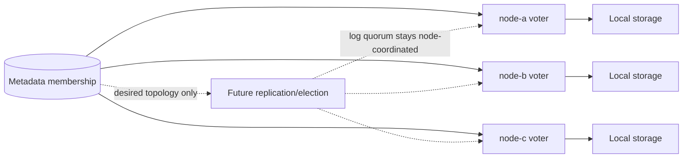

# ADR 0028: Store Immutable Initial Replica Membership in PostgreSQL

## Status

Accepted and implemented in v0.29.

## Context

The current metadata schema stores one node placement for each partition. The
queue node already contains bounded follower transport and durable follower
append mechanics, but no authority identifies the intended followers.

The next replication stages need a stable member set before they can maintain
per-follower progress, calculate a majority, or elect a leader. Building those
features against caller-supplied endpoints would make membership implicit and
unsafe.

PostgreSQL already owns queue configuration, node registration, placement, and
provisioning lifecycle. It is available to hold desired membership, but it must
not become part of the message commit quorum or leader-election vote.

```text
Before this decision

partition ---> one placement row ---> one node
followers ---> caller-provided endpoints, no durable member set

After this decision

partition ---> replica-group row ---> member node A
                    |             `-> member node B
                    `--------------> member node C
```

## Decision

Store the requested replication factor with the queue generation and create one
desired replica group per partition in PostgreSQL.

The initial group contains exactly `replicationFactor` distinct live nodes. All
initial members are `VOTER`s because the group is created before data-plane
traffic begins and every member starts from the same empty history. The model
also reserves `LEARNER` for later catch-up and repair work.

Leadership is not encoded as a membership role. The group stores one bootstrap
leader chosen from its voter members. This is temporary discovery authority
until node-coordinated election is implemented.

Placement selects the least-loaded eligible nodes, using node ID as a stable
tie-breaker. The complete group is inserted atomically. If there are too few
eligible nodes, the group remains `PENDING_CAPACITY` with no partial membership.

Desired membership and observed replica runtime status are stored separately.
A queue becomes active only after every initial member reports `READY` under
its current node registration incarnation and membership version.

Membership is immutable after creation in v0.29. Node failure is reported but
does not cause automatic replacement.



## Why PostgreSQL is not a consensus dependency

PostgreSQL answers:

```text
Who should be a member?
Where should a new node find its assignments?
Which node is the temporary bootstrap leader?
```

Replica nodes will later answer:

```text
Which term is current?
Who is leader now?
Which log index has a durable majority?
```

Therefore a metadata outage may block creation, placement, or discovery, but
it must not be required for an already formed replica group to append,
replicate, elect, or commit once those capabilities exist.

## Consequences

### Positive

- Replication factor becomes explicit customer durability intent.
- Every partition has one inspectable desired replica set.
- A node cannot host two replicas of the same partition.
- Automatic catch-up can later derive follower endpoints from membership.
- Majority size can later be derived from stable voter membership.
- PostgreSQL remains outside the future data commit path.
- Atomic initial placement avoids ambiguous partial groups.

### Negative

- Queue activation now depends on several nodes rather than one.
- An assigned node failure can leave provisioning stuck in this milestone.
- The metadata schema, provisioning claims, and runtime status become
  replica-scoped.
- Existing single-placement APIs require replacement or compatibility handling.
- `VOTER` describes future eligibility but does not provide voting in v0.29.

## Alternatives considered

### Keep one primary placement and store a list of follower endpoints

Rejected. Endpoint lists hide member identity, are difficult to constrain, and
mix current network location with durable membership.

### Let leaders choose followers locally

Rejected. Different leaders could choose different groups, restart would lose
the choice, and operators could not inspect the intended durability topology.

### Use PostgreSQL for every replication acknowledgement

Rejected. It would put metadata in the data path, make it a commit bottleneck,
and replace the replica protocol with database availability.

### Create as many replicas as available

Rejected. It silently weakens requested durability and makes readiness claims
misleading.

### Automatically replace failed members now

Deferred. Safe replacement requires a learner to receive history, prove
catch-up, and enter membership without losing the old majority.

### Encode `PRIMARY` and `FOLLOWER` as permanent membership roles

Rejected. Leadership changes frequently; membership changes less frequently.
Combining them would complicate future elections and failover.

### Require only odd replication factors

Not decided. Odd factors are usually capacity-efficient for majority voting,
but v0.29 does not yet implement consensus. The API rule will be settled during
joint review.

## Review gates

- Agree on failed-provisioning behavior.
- Agree on replication-factor bounds.
- Agree on bootstrap-leader representation.
- Review schema transition from single placement to replica group.
- Confirm that no v0.29 API claims majority durability.

## References

- [Problem and proposed solution](../design/v0.29-replica-membership-problem-and-solution.md)
- [High-level design](../design/v0.29-replica-membership-hld.md)
- [Low-level design](../design/v0.29-replica-membership-lld.md)
- [Proposed semantics](../design/v0.29-replica-membership-semantics.md)
- [Failure scenarios](../design/v0.29-replica-membership-failure-scenarios.md)
