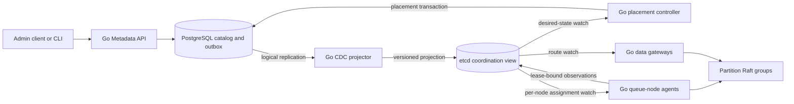
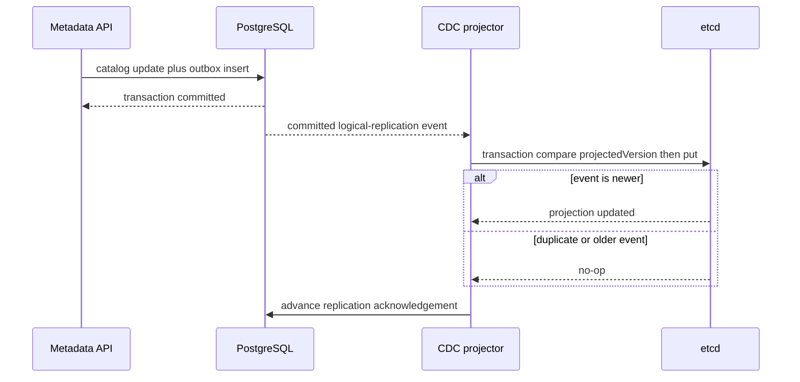
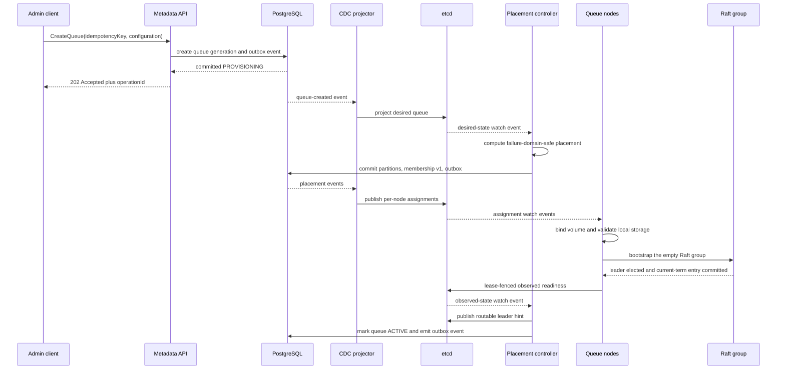
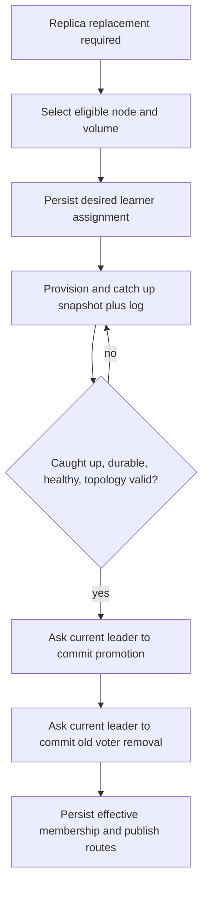

# RFC-104 — Multi-Tenant Queue Control Plane Architecture

## Status

**Accepted; implementation in progress.** The Go metadata API, atomic
PostgreSQL outbox, logical-replication projector, and monotonic etcd projection
are implemented. Node sessions, placement reconciliation, and revision-safe
watch consumers remain target behavior. This status does not authorize
production claims.

**Implementation language:** Go for all new project-owned components.

**Related data-plane design:**
[RFC-105](../design/Data_Plane_Architecture_RFC.md).

## 1. Purpose

The control plane manages long-lived intent and coordinates changes:

- tenants, queues, generations, and queue configuration;
- partition count and replication factor;
- replica placement across nodes, disks, racks, and zones;
- provisioning and decommissioning workflows;
- node and disk observations;
- route publication for gateways;
- safe membership changes.

It does **not** order, replicate, commit, lease, acknowledge, or delete customer
messages. Those are partition-Raft responsibilities.

## 2. Core invariants

1. PostgreSQL is the durable authority for tenant, queue, generation, partition,
   and desired-placement records.
2. etcd is a rebuildable coordination projection for watches, leases, routes,
   controller election, and ephemeral observations.
3. Every PostgreSQL state change and its outbox event commit in one transaction.
4. Queue nodes never poll PostgreSQL for provisioning work.
5. Projection delivery is at least once; applying an event is idempotent and
   monotonic by aggregate version.
6. A stale controller or old node session cannot publish authoritative changes.
7. Existing quorate partitions continue serving messages during total
   control-plane loss.
8. Metadata never overrides a live Raft term, leader, commit index, or committed
   membership.
9. One node cannot host two replicas of the same partition.
10. Partition count and routing version are immutable within a queue generation.

## 3. Authority model

| State or decision | Authority | Cached or projected copy |
|---|---|---|
| Tenant and queue identity | PostgreSQL | etcd desired view |
| Queue generation and configuration | PostgreSQL | etcd desired view and gateways |
| Partition and Raft group identity | PostgreSQL | etcd assignments |
| Desired replica membership | PostgreSQL | etcd per-node assignments |
| Node session and liveness | etcd lease | PostgreSQL observation may lag |
| Disk health and capacity observation | Node report under etcd lease | Controller cache |
| Controller leadership | etcd lease plus transaction fence | None |
| Current partition leader | Raft group | etcd route hint |
| Term, vote, log, commit index | Replica-local Raft storage | Metrics only |
| Message state | Committed partition state machine | No control-plane copy |

The same fact must not have two writable authorities. PostgreSQL desired state
may be stale relative to a Raft membership transition in progress, so the
controller records an operation and lets the Raft group commit the transition
before PostgreSQL marks the new membership effective.

## 4. High-level architecture



The write path from client to partition leader does not cross PostgreSQL, etcd,
the metadata API, projector, or placement controller.

## 5. Deployable components

| Component | Responsibility | Must not do |
|---|---|---|
| Metadata API | Authentication, quota checks, validation, idempotent administrative commands, catalog transactions | Provision local storage or decide message leadership |
| CDC projector | Consume committed outbox events, update etcd monotonically, checkpoint source progress | Invent desired state or silently skip unknown event versions |
| Placement controller | Reconcile queue intent and topology into desired replica placement; orchestrate safe membership operations | Directly edit Raft logs or treat a node heartbeat as committed membership |
| etcd | Watches, leases, controller fencing, assignment distribution, route hints, ephemeral observations | Store message data or become the business catalog |
| Queue-node agent | Maintain a node session, reconcile only its assignments, report observed replica state | Poll all queues or self-assign replicas |
| Gateway | Cache routes and forward data requests | Decide partition membership or message commit |

PostgreSQL and etcd are independently operated dependencies. Their
implementation languages do not change the requirement that project-owned code
is Go.

## 6. Logical model

```text
Tenant
  tenantId

Queue
  queueId
  tenantId
  queueName

QueueGeneration
  queueId
  generationId
  partitionCount
  replicationFactor
  routingAlgorithmVersion
  routingSeed
  queueConfiguration

Partition
  queueId
  generationId
  partitionId
  raftGroupId

ReplicaMembership
  raftGroupId
  membershipVersion
  replicaId
  nodeId
  desiredVolumeClass
  role
  lifecycleState
```

`raftGroupId` and `replicaId` are allocated durable identifiers. They are not
derived from process hash functions. A deleted and recreated queue receives a
new `generationId`, preventing old storage from joining the new history.

`membershipVersion` orders desired membership documents. It does not fence
Raft messages and does not replace Raft term or committed configuration index.

## 7. PostgreSQL transaction and outbox

An administrative mutation uses one transaction:

```text
BEGIN
  validate current aggregate version
  update catalog rows
  insert outbox event with the new aggregate version
COMMIT
```

An outbox event contains:

```text
eventId
aggregateType
aggregateId
aggregateVersion
eventType
schemaVersion
occurredAt
payload
```

Required properties:

- `eventId` is globally unique;
- `aggregateVersion` increases by one for each aggregate mutation;
- payloads are versioned and backward-readable during a rolling deployment;
- the projector rejects or quarantines an unknown schema version;
- outbox retention is bounded only after the CDC checkpoint proves consumption.

## 8. PostgreSQL CDC to etcd

The preferred project-owned path is a Go projector using PostgreSQL logical
replication through a maintained client such as `pglogrepl`. An independently
operated Debezium Server feeding the Go projector remains an alternative. Java
is not embedded in project-owned services.



The etcd transaction compares the stored aggregate version. A duplicate event
is a no-op; an older event cannot overwrite newer state. The projector advances
its PostgreSQL replication acknowledgement only after etcd accepts or
idempotently rejects the event.

### 8.1 Projector outage bound

A logical replication slot retains PostgreSQL WAL. The system monitors retained
bytes and oldest unacknowledged LSN. Before a configured hard storage limit is
reached, administrative writes fail explicitly rather than risking exhaustion
of the PostgreSQL volume. Existing data-plane traffic continues.

### 8.2 Projection rebuild

etcd can be rebuilt without replaying unbounded history:

```text
capture PostgreSQL desired-state snapshot and source LSN
    -> write a new etcd projection generation
    -> start CDC from the captured LSN
    -> catch up changes
    -> atomically switch the active-generation pointer
    -> retire the old generation after all watchers move
```

## 9. etcd key-space

Keys are versioned and encoded with Protobuf or another explicitly versioned
format. JSON may be provided for diagnostics, not as an implicit contract.

```text
/dq/v1/projection/active
/dq/v1/projections/<projectionGeneration>/queues/<queueId>/<generationId>
/dq/v1/projections/<projectionGeneration>/assignments/nodes/<nodeId>/<raftGroupId>
/dq/v1/sessions/nodes/<nodeId>
/dq/v1/observed/replicas/<raftGroupId>/<replicaId>
/dq/v1/routes/<queueId>/<generationId>/<partitionId>
/dq/v1/controllers/placement/leader
/dq/v1/projector/checkpoint
```

Assignment keys are indexed by `nodeId`; a node watches only its own prefix.
This avoids scanning every active queue on every reconciliation cycle.

## 10. Node sessions and fencing

Each queue-node process boot creates a random `incarnationId`, obtains an etcd
lease, and writes:

```text
NodeSession
  nodeId
  incarnationId
  dataAddress
  raftAddress
  topology: region, zone, rack
  volumes: stable volumeId, capacity, health class
  softwareVersion
```

Replica observations are attached to the same lease. Their etcd transaction
compares the current session's `incarnationId`. A restarted process therefore
cannot have observations overwritten by its predecessor after the old lease is
lost.

The session fence protects coordination state only. Raft term and committed
membership protect message authority.

## 11. Revision-safe watch protocol

Every node and gateway follows the same recovery algorithm:

```text
linearizable range read of relevant prefix
    -> capture etcd revision R
    -> reconcile the complete snapshot idempotently
    -> start watch at R + 1
    -> apply ordered watch events
```

If the watch is compacted, cancelled, or has an unprovable gap, the client
discards incremental assumptions and repeats the full range-read protocol.
Watch reconnection never means “continue from now.”

## 12. Queue creation flow



Queue creation is asynchronous. `202 Accepted` means the catalog transaction
committed; it does not mean the queue can yet accept messages. `ACTIVE` requires
all required partitions to have a leader and a healthy voting quorum.

## 13. Placement

Placement is deterministic for the same input snapshot and policy version.
Candidate selection applies hard constraints before scoring:

1. node has an active fenced session;
2. requested storage class and capacity are available;
3. no node already hosts a replica of the partition;
4. replicas satisfy configured host/rack/zone anti-affinity;
5. node and volume are not draining or quarantined;
6. software version is eligible for the group format.

Candidates are then scored using bounded, explainable inputs such as active
replica count, reserved bytes, recovery load, and failure-domain balance.
Observed IOPS can inform scoring but must not cause placement oscillation.

The controller persists the chosen policy version, input observation revision,
and reason. Tie-breaking is stable so a controller restart does not reshuffle
otherwise equal placements.

## 14. Safe membership orchestration

The controller requests changes; the Raft leader commits them:



Only one membership transition is active per group. Removal does not precede a
safe replacement unless an explicitly reviewed emergency-recovery procedure is
being used. PostgreSQL records operation intent and progress; the committed
Raft configuration remains the voting authority.

## 15. Controller leadership

Placement-controller replicas compete for an etcd lease-backed leader key. The
winner records the key's creation revision as its fencing token. Every etcd
mutation made as controller leader includes a compare on that key and revision.

PostgreSQL placement transactions also carry an expected aggregate version and
operation ID. A paused former leader therefore cannot overwrite newer desired
state after another controller takes over.

Leadership is an optimization that prevents conflicting work. Correctness also
depends on idempotent operations and compare-and-set versions.

## 16. Availability and failure behavior

| Failure | Existing quorate partitions | New provisioning or replacement | Administrative writes |
|---|---|---|---|
| Metadata API unavailable | Continue | Existing reconciliation continues | Stop |
| PostgreSQL unavailable | Continue | Stop before new desired state | Stop |
| CDC projector unavailable | Continue | Delayed; retained-WAL alarm grows | May commit until safety threshold |
| etcd unavailable | Continue with cached routes and Raft redirects | Stop | PostgreSQL may accept intent, projection waits |
| Placement controller unavailable | Continue | Pending | Queue create remains `PROVISIONING` |
| One queue node fails | Unaffected groups continue; affected groups depend on majority | Replacement waits for grace policy | Continue |
| Stale controller resumes | Continue | Fenced by etcd and catalog versions | No stale commit |
| etcd projection lost | Continue | Pause while rebuilt | PostgreSQL remains catalog authority |

Node loss is not immediately permanent. A grace window prevents a short network
or power event from triggering a cluster-wide recovery storm. Recovery work is
limited globally, per source node, per target node, per volume, and per tenant.

## 17. Scale model

The design scales by sharding observations and assignments, not by having every
process watch all metadata:

- each queue node watches only `/assignments/nodes/<nodeId>/`;
- gateways watch route prefixes relevant to their cached tenants or receive a
  route-distribution stream;
- controller caches are rebuilt from versioned snapshots plus watches;
- placement work is partitioned into idempotent work items;
- etcd values remain small; message payloads and histories never enter etcd;
- high-cardinality observations use bounded update rates and change thresholds.

If one active placement controller becomes CPU-bound, work ownership may be
sharded by queue hash under separate fenced leases. Sharding is introduced only
after measurement; it does not change PostgreSQL authority.

## 18. Go component boundaries

The Go codebase follows domain boundaries rather than a flat package of HTTP,
SQL, and etcd calls:

```text
cmd/
  metadata-api/
  coordination-projector/
  placement-controller/

internal/controlplane/
  domain/          queue generation, placement, membership operation
  application/     commands, queries, reconciliation use cases
  port/            catalog, outbox, topology, coordination interfaces
  adapter/postgres/
  adapter/etcd/
  adapter/http/
  adapter/cdc/
```

Domain packages do not import PostgreSQL, etcd, HTTP, or Dragonboat clients.
Adapters translate transport/storage types at the boundary.

## 19. Observability

Required signals include:

- outbox age, replication-slot retained bytes, and projector LSN lag;
- projection apply failures, unknown event versions, and version conflicts;
- etcd request latency, watch restarts, compaction recovery, and lease failures;
- controller leadership changes and fenced-write rejections;
- provisioning age by state and failure reason;
- desired-versus-observed replica count;
- recovery work queue depth and migration bandwidth;
- placement rejection reasons and failure-domain violations;
- route age and stale-route redirects.

Logs carry operation ID, queue lineage, Raft group ID, membership version, node
ID, and session incarnation where relevant. They never carry message payloads,
receipt handles, credentials, or tenant secrets.

## 20. Security

- Authenticate and authorize administrative requests by tenant and role.
- Use mTLS between project-owned services and etcd/Raft peers.
- Give the projector write access only to projection prefixes.
- Give nodes write access only to their leased session and observation prefixes.
- Give gateways read-only access to route data.
- Keep PostgreSQL credentials scoped per service.
- Audit queue lifecycle and membership changes with actor and operation ID.

## 21. Design acceptance gates

The control-plane design is accepted only after tests demonstrate:

1. catalog and outbox atomicity under transaction failure;
2. duplicate, reordered, and replayed CDC events cannot regress etcd state;
3. projector crash between etcd apply and LSN acknowledgement is safe;
4. watch compaction and reconnect perform a complete revision-safe resync;
5. an expired controller lease fences all later writes from the old leader;
6. an old node incarnation cannot publish readiness;
7. queue creation reaches `ACTIVE` only after the required Raft conditions;
8. etcd can be rebuilt from PostgreSQL without stopping existing groups;
9. control-plane loss does not enter the message commit path;
10. recovery storms remain within configured concurrency and bandwidth limits.

## 22. Open decisions

1. Direct Go logical replication with `pglogrepl`, or independently operated
   Debezium Server feeding the Go projector?
2. What retained PostgreSQL WAL thresholds warn, reject administrative writes,
   and require operator action?
3. Which topology level is mandatory for replica anti-affinity in the first
   deployment: host, rack, or zone?
4. What exact Raft observation makes a partition routable?
5. How long is the node-loss grace period before replacement begins?
6. When does controller work need sharding beyond one active leader?

## References

- [RFC-105 — Data Plane Architecture](../design/Data_Plane_Architecture_RFC.md)
- [v0.30 target design](../design/v0.30-partitioned-multiraft-design.md)
- [Metadata model](appendix-d-metadata-model.md)
- [Partition model](appendix-a-partition-model.md)
- [etcd API guarantees](https://etcd.io/docs/v3.7/learning/api_guarantees/)
- [PostgreSQL logical decoding](https://www.postgresql.org/docs/current/logicaldecoding.html)
- [pglogrepl](https://github.com/jackc/pglogrepl)
- [Debezium Server](https://debezium.io/documentation/reference/operations/debezium-server.html)
