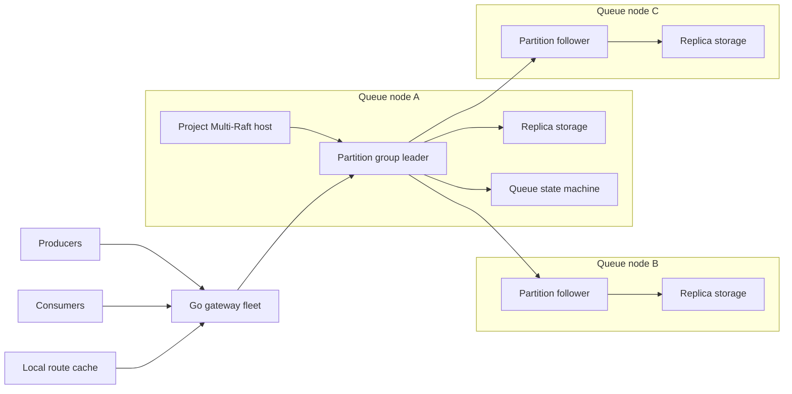
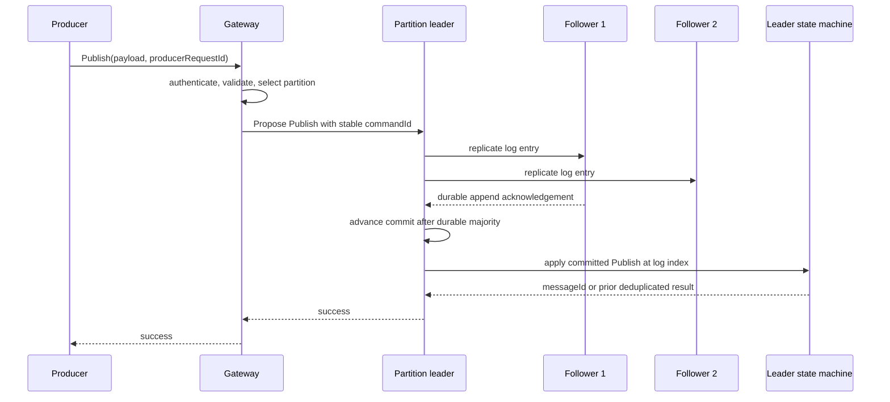
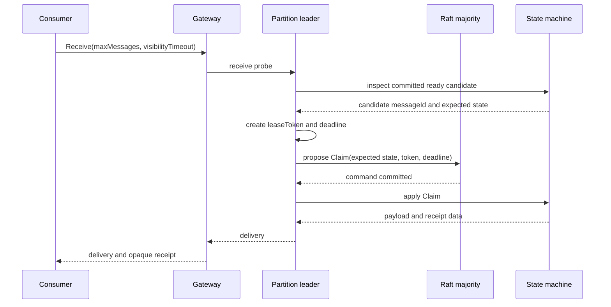
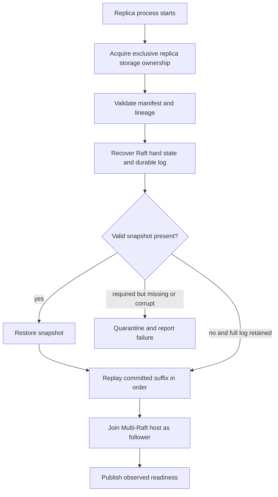

# RFC-105 — Multi-Tenant Queue Data Plane Architecture

## Status

**Accepted; implementation in progress.** The deterministic Go state machine,
snapshot format, routing function, receipt fencing, and project-owned consensus
port are implemented. The current local consensus adapter is for semantic tests
only; multi-Raft integration and distributed guarantees remain pending. The
Java queue remains a semantic reference. No production-readiness or performance
claim is made by this RFC.

**Implementation language:** Go.

**Accepted consensus core:** `go.etcd.io/raft/v3 v3.7.0`. ADR 0033 makes the
durable Multi-Raft host an explicit project responsibility.

**Related control-plane design:**
[RFC-104](../architecture/Control_Plane_Architecture_RFC.md).

## 1. Purpose

The data plane accepts customer message operations, routes them to partitions,
replicates every state-changing command, and serves committed queue state.

It owns:

- partition selection and route-cache use;
- Raft leadership, replication, and majority commit;
- publish, claim, ACK, NACK, retry, lease expiry, and dead-letter transitions;
- replica-local log, snapshots, recovery, and volume binding;
- backpressure, fairness, and failure isolation on queue nodes.

It does not own tenant creation, desired placement, quotas as catalog records,
or administrative workflow history.

## 2. Guarantees, non-guarantees, and assumptions

### 2.1 Guarantees after the target is implemented

- A successful mutation was committed by the target partition's Raft majority
  under the configured durability policy and applied by the leader.
- Only committed commands change externally visible queue state.
- Each partition has one ordered command history.
- Acknowledged messages survive failure of a minority of replicas.
- Delivery is at least once. Consumer failure or an ambiguous response may
  produce redelivery.
- A stale receipt cannot acknowledge a newer delivery attempt.
- Keyed messages remain in one partition for the queue generation.
- Existing quorate partitions continue during control-plane loss.

### 2.2 Non-guarantees

- No total order across partitions.
- No exactly-once consumer side effect.
- No atomic operation spanning two partitions or queues.
- An empty receive response does not prove that every partition is empty.
- Queue-wide FIFO is not provided by partition affinity alone.
- A successful PostgreSQL or etcd write does not mean a message committed.
- A locally appended but uncommitted entry is not visible queue state.

### 2.3 Infrastructure assumptions

- A storage device and filesystem honor the sync primitive used by the selected
  LogDB under the documented power-loss model.
- Replica placement uses independent hosts and required failure domains.
- Node identities, TLS identities, and volume identities are stable.
- Severe correlated failure beyond the configured replication factor can lose
  availability and may lose data.
- Clock synchronization stays within an explicit operational bound; timing
  precision is an availability property, not consensus authority.

## 3. Data-plane invariants

1. One queue partition maps to one Raft group.
2. All queue-state mutations enter through that group's leader.
3. Followers never serve a mutation from uncommitted local state.
4. `Receive` is a mutation: the claim must commit before the message is returned.
5. State-machine application is deterministic and log-index ordered.
6. `Apply` never reads wall clock, randomness, filesystem state, or network state.
7. A client success is not emitted before the command is committed, durable under
   policy, and applied on the responding leader.
8. Snapshot reclamation never removes the only recoverable copy of committed
   state.
9. A node never hosts two voters for the same group.
10. Memory, queued bytes, snapshot work, recovery work, and network work are
    bounded.
11. Control-plane metadata is never in the message commit quorum.
12. A physical-storage optimization cannot weaken per-group ordering or
    corruption isolation.

## 4. High-level architecture



The gateway and route cache are replaceable. The Raft log and snapshot chain are
the durable authority for a partition.

## 5. Identity hierarchy

```text
tenantId
  queueId
    generationId
      partitionId
        raftGroupId / RawNode group key
          replicaId / Raft node ID
            nodeId
            volumeId
```

- `generationId` prevents storage from a deleted queue incarnation being reused.
- `partitionId` is stable within a generation.
- `raftGroupId` is a durable allocated `uint64`, not a truncated UUID hash.
- `replicaId` is stable for one membership identity and is never reused inside
  the same group history.
- `volumeId` is a stable configured identity, not only a mount path.

Every storage artifact records sufficient lineage to reject cross-generation or
cross-partition recovery.

Replication factor is queue-generation configuration. The default is three,
which tolerates one unavailable replica while retaining a majority. Factor one
is restricted to local development or explicitly non-durable tiers. Larger
factors require a placement and latency review; they are not silently selected
by the queue node.

## 6. Partition routing

### 6.1 Keyed publish

```text
partitionId = stableHash(
    routingAlgorithmVersion,
    routingSeed,
    messageGroupId
) mod partitionCount
```

The algorithm version, seed, and partition count are immutable within a queue
generation. FIFO message-group mode additionally permits only one in-flight
message per group.

### 6.2 Unkeyed publish

When the client supplies an idempotency key:

```text
partitionId = stableHash(routingSeed, producerRequestId) mod partitionCount
```

A retry reaches the same partition. Without a stable client key, the gateway may
choose a partition using a balanced policy, and an ambiguous retry can create a
duplicate.

### 6.3 Receive

Receive uses a rotating starting partition and probes a configured maximum. It
does not synchronously fan out to every partition. A gateway may maintain
short-lived readiness hints, but hints are never claim authority.

### 6.4 ACK and NACK

The opaque authenticated receipt contains routing information:

```text
queueId, generationId, partitionId, messageId,
deliveryAttempt, leaseToken, integrityTag
```

ACK and NACK route directly to the owning partition and never scan partitions.

## 7. Gateway behavior

The gateway terminates the public protocol, authenticates the tenant, enforces
request-size and admission limits, calculates a partition, and forwards to a
leader hint.

If the target is not leader, it returns a safe hint when known. The gateway
refreshes its cache and retries with the same `commandId`. Redirect loops and
retry count are bounded.

Gateways retain routes in memory when etcd is unavailable. If a hint is stale,
Raft-level `NOT_LEADER` responses can repair it. Gateway loss never loses
committed messages.

## 8. Deterministic queue state machine

### 8.1 Command envelope

```text
QueueCommand
  schemaVersion
  commandId
  tenantId
  queueId
  generationId
  partitionId
  commandType
  commandPayload
```

Commands are encoded with a versioned language-neutral format such as Protobuf.
They do not depend on Go map iteration, `gob`, process memory layout, or implicit
character encoding.

### 8.2 Initial command set

```text
Publish(messageId, producerRequestId, payload, availableAt)
Claim(messageId, leaseToken, attempt, leaseDeadline)
Acknowledge(messageId, leaseToken, attempt)
NegativeAcknowledge(messageId, leaseToken, attempt, availableAt)
ExpireLease(messageId, leaseToken, attempt, observedAt)
MakeDelayedReady(messageId, expectedAvailableAt, observedAt)
MoveToDeadLetter(messageId, expectedAttempt, observedAt)
```

Every conditional command includes the expected current identity. Applying an
old expiry or ACK after a later delivery is a deterministic no-op or stale-handle
result, never a mutation of the newer attempt.

### 8.3 State model

```text
MessageState
  payload and attributes
  status: DELAYED | READY | IN_FLIGHT | DEAD_LETTER
  enqueueOrder
  availableAt
  deliveryAttempt
  activeLeaseToken
  leaseDeadline

PartitionState
  messagesById
  readyOrder
  delayedByDeadline
  leasesByDeadline
  producerDeduplication
  messageGroupLocks
  deadLetterState
  lastAppliedIndex
  logicalTimeFloor
```

Snapshots serialize maps in a canonical key order. The same snapshot and command
suffix must always produce the same state and result sequence.

### 8.4 Time and randomness

The leader may read time and generate a cryptographically random lease token
before proposing a command. Those values are carried in the command. `Apply`
uses only command values and current replicated state.

The state machine records a nondecreasing logical time floor. A new leader whose
wall clock is behind does not expire messages early. Clock error may delay
redelivery, but must not create an early expiry.

## 9. Publish flow



Replication and local persistence may overlap. The response condition does not:
the leader replies only after the durability and apply invariant is satisfied.

If the client times out after commit but before receiving the response, retrying
the same producer request ID returns the committed result. Deduplication entries
have a documented retention bound; retries outside that bound may duplicate.

## 10. Receive and claim flow

Reading a ready message and making it invisible are one replicated transition:



A read-index check alone is insufficient because claim changes queue state. A
leader may inspect a candidate optimistically, but only the committed conditional
`Claim` decides who received it.

Long-poll waiters are ephemeral and are not replicated. A publish notification
wakes a bounded waiter; the awakened request still follows the claim protocol.
Leader failure may drop waiters, which reconnect without losing messages.

## 11. ACK, NACK, expiry, and DLQ

ACK and NACK are conditional replicated commands. Success is returned only after
commit and apply.

- ACK deletes the active message only when lease token and attempt match.
- NACK invalidates the lease and makes the message ready or delayed according to
  the command.
- The leader schedules expiry candidates from committed deadlines.
- `ExpireLease` verifies the same token, attempt, and deadline before mutation.
- When attempts reach the configured limit, a command moves the message into
  dead-letter state.

The first distributed version keeps dead-letter state inside the source
partition. Forwarding to a separate customer DLQ would be a cross-group workflow
and is explicitly not atomic; it requires its own idempotent delivery design.

## 12. Multi-Raft runtime

### 12.1 Mapping

| Queue concept | etcd/raft host concept |
|---|---|
| Partition | One `RawNode` / Raft group |
| `raftGroupId` | Project-owned stable group key |
| Replica identity | Raft node ID within the group |
| Queue-node process | Project-owned Multi-Raft host |
| Queue state machine | Project-owned committed-entry adapter |
| Raft durable log | Project-owned per-volume storage implementing `Storage` |
| Portable queue snapshot | Project-owned snapshot stream and transfer protocol |

etcd/raft types stop at the consensus adapter and host boundaries. Domain
commands and results do not expose them.

### 12.2 Why etcd/raft is accepted

`etcd/raft v3.7.0` is a supported deterministic consensus core with broad
production lineage. It exposes the protocol work as explicit `Ready` batches,
which lets this project control per-volume durability, group commit, scheduling,
transport batching, fault injection, and multi-tenant fairness.

That control is also a cost. The project owns network transport, durable
storage, snapshot transfer, proposal correlation, Multi-Raft scheduling, and
group lifecycle. ADR 0033 accepts that ownership; it does not attribute those
capabilities to the library.

### 12.3 Rejected target alternatives

Dragonboat remains useful experimental evidence but its required v4 line is
still marked unstable upstream. HashiCorp Raft must prove high-density shared
resource operation and does not remove the target host-density concern. A
custom Raft algorithm is rejected because consensus correctness would dominate
queue development.

## 13. Commit and durability model

For replication factor three, a command commits after the leader has the entry
and one follower acknowledgement that satisfies the configured durable-log
contract. A successful `RawNode.Propose` call is not completion. The adapter
correlates the command with a committed entry and responds only after ordered
state-machine apply produces its result.

```text
proposed
  -> encoded and accepted by leader
  -> durably appended locally
  -> durably acknowledged by a majority
  -> committed by Raft
  -> applied in log-index order
  -> client success permitted
```

The design requires majority-durable acknowledgement. A configuration that lets
a follower acknowledge before durable persistence is unacceptable for this
policy. If the project later offers weaker durability tiers, they require a
separate semantic contract and explicit client selection.

`commitIndex` is Raft authority, propagated by the leader in replication and
heartbeat traffic. Each replica persists the hard state required by the selected
library and persists snapshot/applied boundaries. A locally durable entry above
the committed boundary remains invisible and may be overwritten by a future
leader.

## 14. Storage architecture

### 14.1 Durable authority chain

```text
Raft hard state
  + checksum-valid durable Raft log
  + latest valid state-machine snapshot
  = recoverable replica
```

The queue must not maintain a second application WAL beside the Raft WAL for
the same commands. Two logs would create an ambiguous recovery authority.

### 14.2 Stable volume binding

Volume count is node configuration, not a constant in queue semantics. A host
may expose one disk or twenty disks using stable identities:

```text
nodeId: node-17
volumes:
  - volumeId: nvme-00
    path: /mnt/nvme0n1/distributed-queue
    storageClass: local-nvme
  - volumeId: nvme-01
    path: /mnt/nvme1n1/distributed-queue
    storageClass: local-nvme
```

The control plane chooses a host and required storage class. The queue node
binds the replica to one eligible local `volumeId`, persists that binding, and
reports it as observed state. Restart reuses the binding; it does not hash the
queue to a possibly different mount.

```text
<volume-root>/distributed-queue/
  replicas/
    <queueId>/
      <generationId>/
        partition-<partitionId>/
          replica-manifest
          raft/
          snapshots/
          state/
          quarantine/
```

The manifest records lineage, Raft group ID, replica ID, volume ID, format
version, and last clean shutdown marker. Moving a directory does not silently
change its volume identity.

### 14.3 Project-owned multiplexed Raft WAL

Because etcd/raft deliberately supplies no disk I/O, the host owns a
volume-aware durable store. The first correctness slice is single-group. A
later measured slice multiplexes groups per volume and batches their appends
into one sync without weakening per-group ordering or completion.

A custom multiplexed WAL is accepted only if it provides:

- group, term, and index identity in durable records;
- checksums and explicit batch/torn-tail recovery;
- per-group range lookup and atomic hard-state updates;
- one sync completion that maps correctly to every included group;
- failure poisoning so no operation after a failed/torn append reports success;
- bounded per-group fairness;
- safe segment reclamation with all referenced groups accounted for;
- recovery time that does not scale unacceptably with unrelated groups.

The frame format is selected only after the single-group correctness slice
proves recovery and completion semantics and a benchmark identifies the batch
and lookup requirements for multi-group storage.

## 15. State storage and snapshots

The logical state may start as an in-memory implementation for correctness tests,
but a production-scale queue needs an on-disk state backend or checkpointable
store because live payloads cannot grow without bound in heap.

The Raft log remains recovery authority until a snapshot including its committed
prefix is durably published. Disabling an embedded store's own WAL is safe only
if replayable Raft history is retained until a durable checkpoint covers it.

A portable snapshot contains:

```text
formatVersion
queue lineage and raftGroupId
lastIncludedIndex
lastIncludedTerm
canonical queue state or state-store checkpoint
content manifest and checksums
```

It does not contain a source node's physical WAL offset as receiver authority.
The receiver installs portable state, establishes its own local storage boundary,
and then receives the suffix after `lastIncludedIndex`.

`lastIncludedTerm` is the term of the log entry at the snapshot boundary. It is
not the node's current term. Together with the index it lets Raft verify history
matching after the older prefix is gone.

Log reclamation requires:

```text
snapshot durably published
    AND snapshot index <= lastApplied
    AND snapshot lineage and checksums valid
    AND selected Raft library accepts the snapshot boundary
```

## 16. Recovery and follower replay



Followers can apply committed entries while receiving newer replication. The
receive, durable-append, commit-notification, and apply stages are pipelined but
bounded. Apply order remains strictly increasing, and a slow apply pipeline
backpressures replication before memory grows without limit.

A follower that is behind the retained log installs a snapshot and then streams
the suffix. Snapshot transfer and ordinary replication use separate bounded
budgets so recovery cannot starve customer traffic.

## 17. Membership and promotion

A replacement starts as a non-voting learner when supported by the selected
library. It becomes promotion-eligible only when:

- its storage lineage and manifest match;
- its snapshot and retained suffix form a valid history;
- it has durably caught up within the approved lag bound;
- its applied index satisfies the promotion policy;
- its disk and node session are healthy;
- placement anti-affinity still holds;
- no other membership change is in progress.

The current Raft leader commits promotion and removal. PostgreSQL records the
workflow but cannot declare a voter by itself.

## 18. Concurrency, group commit, and backpressure

The queue node shares bounded resources across groups:

- peer connections and replication streams;
- Raft execution workers;
- proposal and apply workers;
- Raft WAL and sync workers;
- snapshot and recovery pools;
- per-volume I/O permits;
- tenant and group admission budgets.

The design prohibits one unbounded goroutine, timer, connection pool, or metric
label set per group. Goroutines are cheap, not free.

Group commit may combine entries from multiple groups in one physical sync only
when the Raft store preserves each group's ordering and reports completion correctly.
A sync failure fails every dependent completion and poisons or quarantines the
affected writer until recovery proves a safe append boundary.

Limits exist at least for:

- pending commands and bytes per partition, tenant, node, and volume;
- uncommitted bytes per group;
- concurrent RPCs and queued bytes per peer;
- long-poll waiters;
- concurrent snapshots and snapshot bytes in flight;
- recovery and membership operations;
- receive partition probes.

Overload is rejected before accepting unbounded work. A quorate leader can still
return retryable overload when its local safety limits are reached.

## 19. Multi-tenant fairness

Admission control starts at the gateway and is repeated at the queue node because
gateways are not a trust or capacity boundary. Scheduling accounts for both
operations and bytes; otherwise large messages defeat request-count quotas.

A hot tenant must not consume all proposal slots, Raft WAL batches, snapshot
bandwidth, or recovery permits. Candidate policies include deficit round-robin
and hierarchical token buckets. The chosen policy must preserve per-partition
order while allowing unrelated groups to progress.

Fairness is an availability property. Raft safety must not depend on the
scheduler being fair.

## 20. Failure behavior

| Failure | Required behavior |
|---|---|
| Leader crashes before commit | Client receives failure/timeout; uncommitted entry is never applied and may be overwritten |
| Leader crashes after commit before response | Retry with same command ID returns prior result; without a retained dedupe key, duplicate delivery remains possible |
| Follower disk fails | Follower stops durable acknowledgements; group continues only with majority |
| Leader disk stalls | Pending operations time out/backpressure; leadership transfer may be requested, but safety never assumes transfer succeeded |
| Minority network partition | Majority side elects/keeps leader; minority cannot commit or claim messages |
| Control plane unavailable | Existing groups and cached routing continue; no provisioning or membership changes |
| Snapshot corrupt | Reject it; replay full retained history if possible, otherwise fail/quarantine replica and recover from peer |
| Torn Raft WAL tail | Recover only the checksum-valid durable prefix; never report later entries durable |
| Stale ACK | Conditional apply rejects old lease token/attempt |
| Timer fires twice | Duplicate conditional expiry is a deterministic no-op |
| One tenant overloads node | Tenant/group limits throttle it while preserving unrelated capacity |
| Node restarts with many groups | Staged recovery prevents open-file, memory, CPU, and disk storms |

Voluntary leader transfer is a performance recovery tool, not a safety primitive.
A gray disk failure is handled first by stopping successful acknowledgements and
marking the local replica unhealthy.

## 21. Consistency and client-visible outcomes

Every mutation returns one of three classes:

```text
SUCCESS
  command committed and applied; result is authoritative

DEFINITIVE_FAILURE
  command rejected before proposal or deterministically rejected by apply

AMBIGUOUS
  timeout or connection loss; command may have committed, so retry with same ID
```

The public API must not translate ambiguous outcomes into definitive failure.
Producer idempotency and receipt identities exist to make retries safe within
their documented retention periods.

## 22. Go component boundaries

```text
cmd/
  queue-gateway/
  queue-node/

internal/dataplane/
  domain/           queue state and deterministic commands
  application/      publish, receive, ack, nack use cases
  routing/          stable partition selection and route cache
  consensus/        project-owned Raft port and etcd/raft adapter
  storage/          manifests, volumes, Raft WAL, hard state, snapshots
  runtime/          group registry, lifecycle, admission, scheduling
  transport/        public API and peer security integration
```

The domain package imports neither etcd/raft nor etcd clients. A narrow
consensus port owns proposal, query, membership, snapshot, and status
translation. This permits fault tests and a future consensus-library
replacement without rewriting queue semantics.

The Java implementation is a temporary semantic oracle. Language-neutral golden
command histories compare Java results with Go results. Binary WAL and snapshot
compatibility is not required because this learning-stage system has no
production data migration requirement.

## 23. Observability and security

Required metrics include:

- proposal, commit, and apply latency separately;
- commit index minus applied index;
- follower match and durable lag;
- pending commands/bytes by tenant, group, peer, and volume;
- Raft WAL append, sync, batch size, and failure counts;
- election, leadership transfer, and `NOT_LEADER` counts;
- snapshot duration, bytes, failures, and install interference;
- recovery queue depth and time-to-ready;
- Go heap, allocation rate, GC CPU/pause, goroutines, and scheduler latency;
- publish/receive/ACK/NACK outcome classes and ambiguous responses.

Use mTLS for gateway-to-node and peer-to-peer traffic. Authenticate tenant
identity at the gateway and bind it to the forwarded request; never trust a
payload tenant ID alone. Logs and traces must not contain payloads, credentials,
receipt handles, deduplication tokens, or cryptographic secrets.

## 24. Performance model and benchmarks

Throughput and latency are measured outcomes, not architecture facts. No target
such as “one million messages per second” is accepted without workload, payload,
hardware, replication, durability, and percentile definitions.

The benchmark matrix includes:

- one group and many groups; idle and active group density;
- 1 B, 1 KiB, 64 KiB, and maximum supported payloads;
- replication factors one and three where semantically allowed;
- sync every entry versus supported group commit;
- single-group Raft WAL versus the measured multiplexed and group-commit design;
- 1, 4, and representative maximum volume counts;
- publish, receive/claim, ACK, NACK, and mixed lifecycle workloads;
- snapshots, follower catch-up, and node restart during foreground traffic;
- slow disk, slow follower, packet loss, and leader failover;
- fair sharing between hot and quiet tenants;
- p50, p95, p99, p99.9, throughput, CPU, memory, disk bytes, and network bytes.

Any language or storage conclusion must identify the limiting layer rather than
attribute all latency to Go, Raft, or the disk.

## 25. Design acceptance gates

The data-plane design is accepted only after tests demonstrate:

1. publish success is impossible before majority-durable commit and leader apply;
2. claim is committed before delivery and cannot be granted twice concurrently;
3. stale ACK, NACK, and expiry commands cannot mutate a newer delivery attempt;
4. crash/restart applies committed entries exactly once to reconstructed state;
5. uncommitted durable suffixes never become visible merely because they exist;
6. snapshot installation plus suffix replay equals full-history replay;
7. snapshot reclamation cannot delete the only recoverable committed history;
8. node, disk, and network failures preserve Raft safety;
9. control-plane loss does not stop existing quorate partitions;
10. all queues, bytes, goroutines, RPCs, snapshots, and recovery paths are bounded;
11. the project-owned etcd/raft host meets group-density and multi-volume
    requirements without weakening the Ready persistence contract;
12. Go state-machine results match the language-neutral semantic corpus derived
    from the current Java behavior and reviewed semantics.

## 26. Open decisions

1. Which WAL index and segment layout best supports per-volume group commit and
   bounded recovery?
2. What batch policy balances fsync amortization, fairness, and publish p99?
3. Which state backend holds large live payload sets while preserving snapshot
   and replay invariants?
4. What precise sync configuration proves majority-durable acknowledgement?
5. What are the initial group, pending-byte, snapshot, and recovery limits?
6. What clock-error bound and leader clock gate govern lease expiry?
7. What deduplication retention window is exposed to producers?
8. Does the first distributed release support standard queues only, or FIFO
   message-group locking as well?

## References

- [RFC-104 — Control Plane Architecture](../architecture/Control_Plane_Architecture_RFC.md)
- [v0.30 target design](v0.30-partitioned-multiraft-design.md)
- [Storage architecture](storage-architecture.md)
- [Partition model](../architecture/appendix-a-partition-model.md)
- [Replication protocol](../architecture/appendix-b-replication-protocol.md)
- [Group commit and durability](../architecture/appendix-c-group-commit-and-durability.md)
- [ADR 0033: etcd/raft core and owned host](../adr/0033-accept-etcd-raft-core.md)
- [Dragonboat](https://github.com/lni/dragonboat)
- [Dragonboat storage](https://github.com/lni/dragonboat/blob/master/docs/storage.md)
- [etcd Raft library](https://github.com/etcd-io/raft)
- [HashiCorp Raft](https://github.com/hashicorp/raft)
- [Raft paper](https://raft.github.io/raft.pdf)
