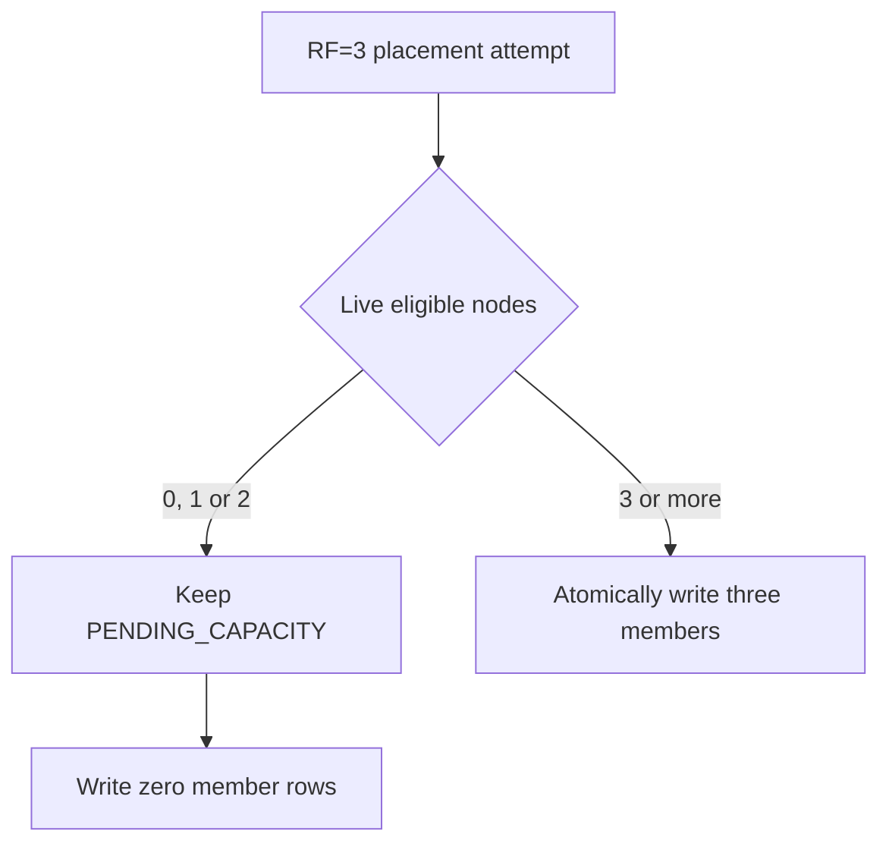
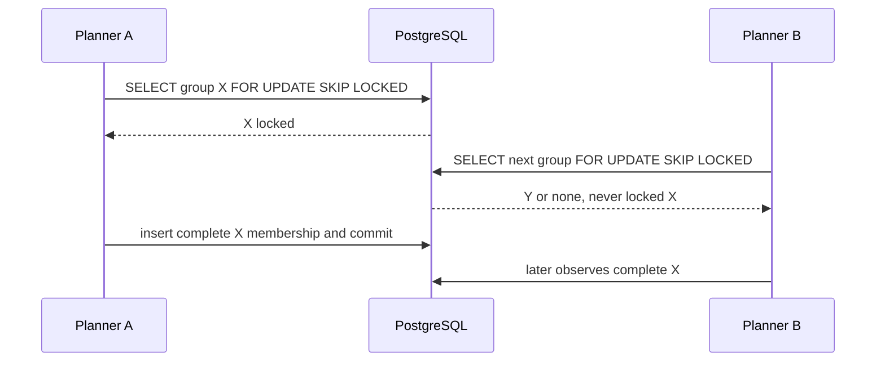
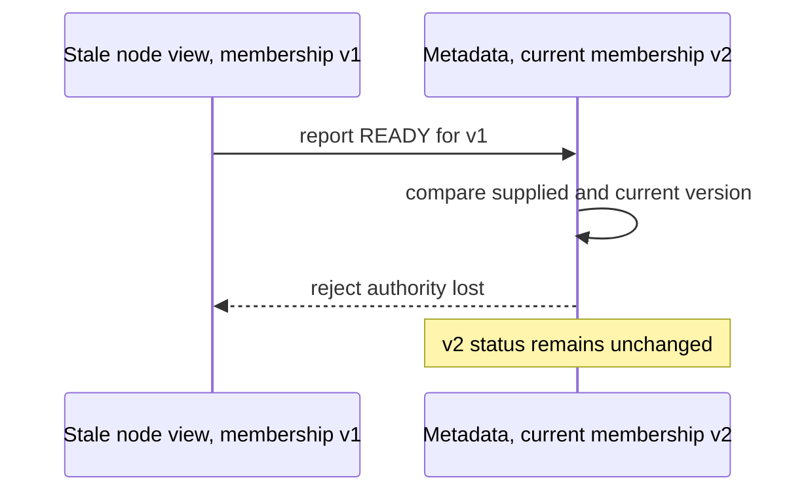
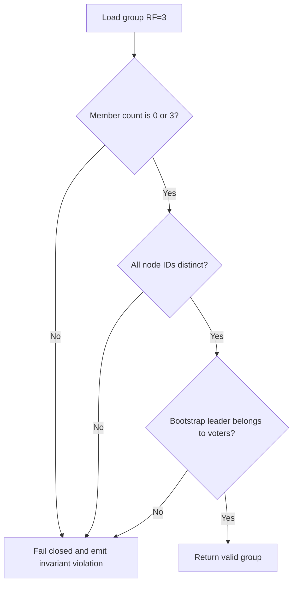

# v0.29 Failure Scenarios — Replica Membership and Placement

## Status

Implemented failure behavior for v0.29. Later replication failures remain
explicitly deferred.

## F1. Fewer live nodes than replication factor

Example:

```text
requested replication factor = 3
eligible live nodes = 2
```

Required behavior:

- keep group `PENDING_CAPACITY`;
- insert no member rows;
- do not activate or publish a route;
- retry placement after topology changes;
- expose the capacity reason to operators.

Severity: high if mishandled, because partial placement would silently weaken
the requested durability topology.



## F2. Two planners select the same pending group

Required behavior:

- one transaction locks the group;
- the other skips it or observes the committed result;
- exactly one membership version is created;
- no duplicate members appear.

Test with two real PostgreSQL transactions, not mocks.



## F3. Planner crashes before transaction commit

Required behavior:

- PostgreSQL rolls back group and member changes;
- no partial group becomes visible;
- another planner can retry.

## F4. Planner response is lost after commit

Required behavior:

- retry observes the existing complete group;
- it does not create another configuration or increment membership version;
- nodes can discover the committed assignments.

## F5. Selected node lease expires immediately after placement

Required behavior:

- placement remains the desired immutable group;
- the expired process cannot fetch assignments or report READY;
- the group remains non-active;
- no automatic replacement occurs in v0.29.

The live-node safety margin reduces this race but cannot remove it.

## F6. Node restarts during provisioning

Required behavior:

- node registers with a higher registration epoch;
- reports from the old incarnation are rejected;
- the new incarnation fetches the same membership assignment;
- it opens or recovers the same lineage directory;
- successful recovery publishes READY under the new epoch.

## F7. Node opens storage with the wrong lineage

Required behavior:

- WAL or snapshot lineage validation fails closed;
- node reports FAILED with a bounded, non-sensitive reason;
- it never reports READY and never serves that replica.

## F8. One of three replicas fails local provisioning

Example:

```text
node-a READY
node-b READY
node-c FAILED
```

Required common behavior:

- group does not activate;
- bootstrap leader does not accept customer traffic;
- the failed member is not silently removed or replaced.

Open policy decision:

- remain `PROVISIONING` and retry with bounded backoff; or
- enter `PROVISIONING_FAILED` and require an explicit retry action.

Recommendation: retry a bounded number of transient failures, then publish
`PROVISIONING_FAILED` for operator visibility. Exact retry policy belongs in
implementation configuration.

```text
                node-c open fails
                        |
                        v
                 retry with backoff
                        |
             +----------+----------+
             |                     |
         recovery works       retry limit reached
             |                     |
             v                     v
       node-c reports READY   report FAILED
             |                     |
             v                     v
       group may activate     PROVISIONING_FAILED
```

## F9. Stale membership version reports READY

Required behavior:

- conditional update affects no current row;
- caller receives an authority-lost response;
- current runtime status remains unchanged.

Although v0.29 uses only version one, this fence is required before later
membership replacement is introduced.



## F10. Duplicate READY report

Required behavior:

- identical current report is idempotent;
- activation remains monotonic;
- metadata version does not churn unnecessarily.

## F11. Bootstrap leader is not a member

This represents database corruption or a repository bug.

Required behavior:

- group validation fails closed;
- no route is published;
- emit an ERROR event with group identity;
- require repair rather than guessing a leader.

Database constraints should prevent this state where practical.

## F12. Two bootstrap leaders appear

Required behavior:

- schema/domain constraints reject the write;
- nodes do not infer leadership from list order;
- no group activation occurs.

Storing one leader node ID on the group row makes this invalid state harder to
represent than storing independent boolean flags on member rows.

## F13. Metadata unavailable during placement

Required behavior:

- no group publication is claimed;
- planner retries with bounded backoff;
- no local storage is created from an uncommitted choice.

## F14. Metadata unavailable while a node reconciles

Required behavior follows the existing authority-guarded node policy:

- a node must not invent new assignments;
- existing local files remain untouched;
- admission behavior is governed by current lease/authority rules;
- recovery occurs after metadata returns.

v0.29 does not promise metadata-independent operation.

## F15. Node receives the same assignment repeatedly

Required behavior:

- one local storage owner exists for the lineage;
- existing WAL/snapshot files are validated, not recreated destructively;
- READY publication may be retried safely.

## F16. Leader and follower components both try to open one lineage

Required behavior:

- one node-local replica catalog owns the storage handle;
- role-specific runtimes borrow that ownership rather than reopening files;
- the WAL filesystem lock remains a final safety check;
- conflicting local ownership prevents readiness.

## F17. Member node fails after the group becomes active

Required behavior:

- membership remains unchanged;
- health is reported as degraded or unavailable;
- no empty replacement is promoted;
- the same node may recover its durable local state and become ready again.

Because majority commit does not exist yet, this status must not claim whether
any particular message is safely replicated.

```text
ACTIVE group: A, B, C
         |
         | node C lease expires
         v
Desired membership remains: A, B, C
Observed health becomes:    A READY, B READY, C UNAVAILABLE
Automatic replacement:      none in v0.29
Message quorum claim:        none in v0.29
```

## F18. Replication factor differs on an idempotent create retry

Example:

```text
first request:  idempotency key K, RF=3
second request: idempotency key K, RF=1
```

Required behavior:

- reject as an idempotency conflict;
- preserve the original queue generation and replication factor.

## F19. Corrupt member count

Example:

```text
group RF=3
member rows=2
group state=PROVISIONING or ACTIVE
```

Required behavior:

- repository reconstruction rejects the group;
- assignment and route APIs fail closed for it;
- emit an invariant-violation event;
- never silently reduce RF to two.

Atomic insertion prevents ordinary occurrence, but recovery must still defend
against corruption or manual database edits.



## F20. Very large node registry or assignment set

Required behavior:

- assignment query uses an index beginning with `node_id`;
- placement load counting uses supporting indexes;
- responses are bounded or paginated before unbounded scale is claimed;
- measure queries with realistic row counts before release.

This is an operational scalability risk, not a message hot-path risk.

## Joint-review checklist

- Is every incomplete group prevented from serving traffic?
- Can any stale process publish current readiness?
- Can any transaction expose partial membership?
- Can one node appear twice in a group?
- Can metadata readiness be mistaken for replicated or committed data?
- Does any failure automatically change membership before safe catch-up exists?
- Can two local components own the same WAL?
