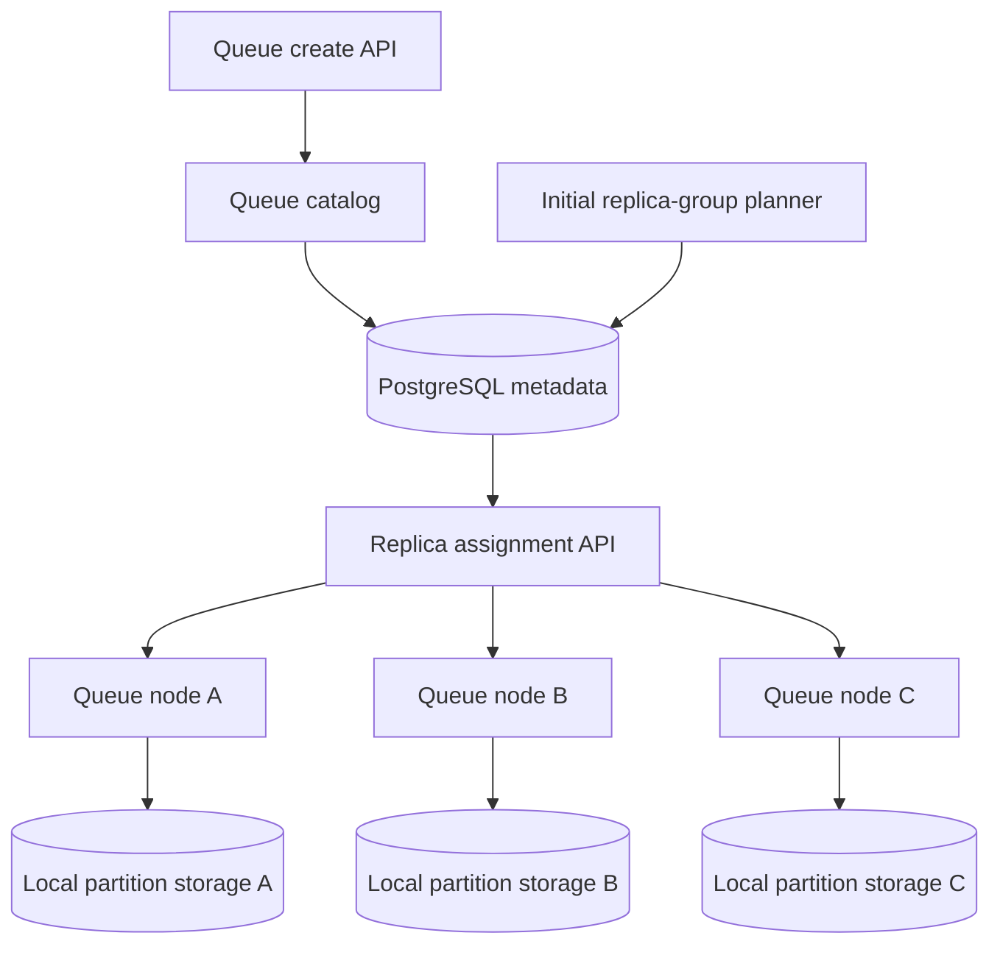
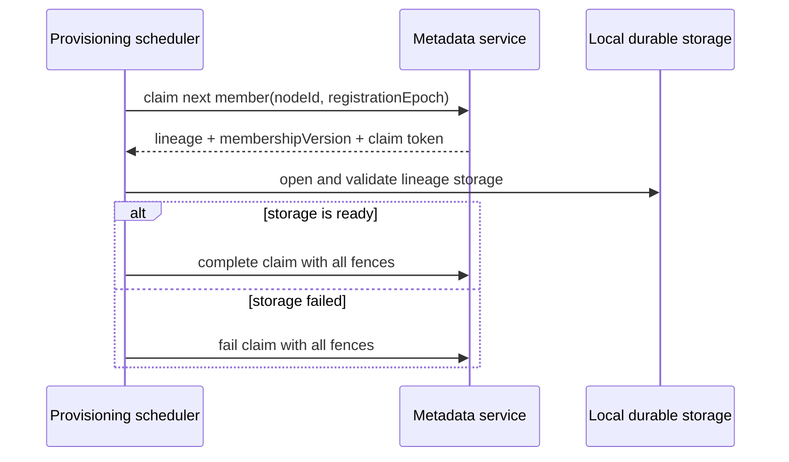
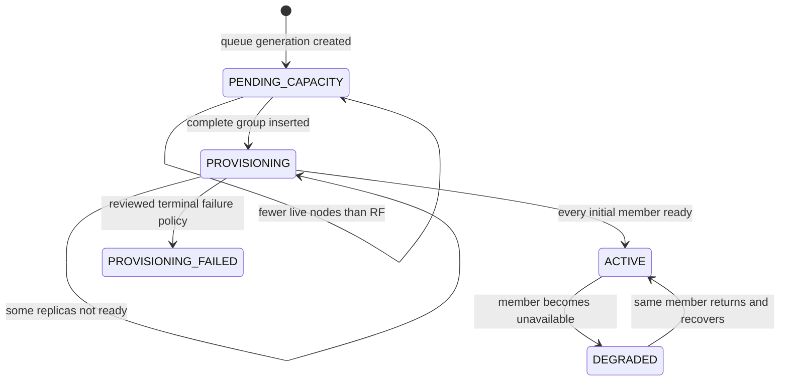
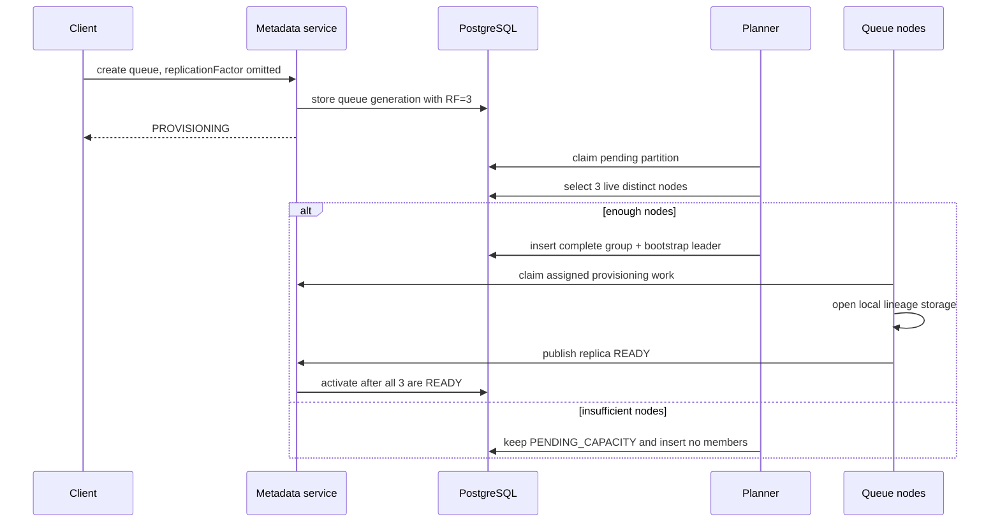
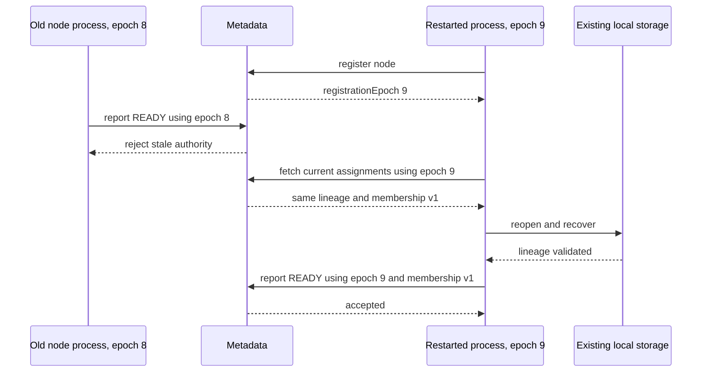
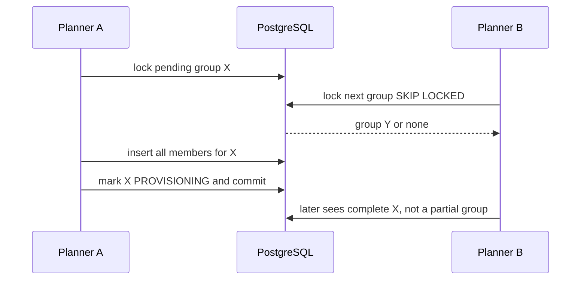

# v0.29 High-Level Design — Replica Membership and Placement

## Status

Implemented in v0.29. Deferred behavior remains labelled explicitly.

## Goal

Give every partition a complete, durable, and inspectable initial replica set.
Queue nodes must be able to discover their assigned replicas and report local
readiness without putting PostgreSQL in the message replication or commit path.

## Before and after

```text
Before

Metadata                         Queue nodes
partition -> one node            follower endpoint exists
                                 but membership is unknown


After v0.29

Metadata
partition -> replica group version 1
             |- node-a VOTER, bootstrap leader
             |- node-b VOTER
             `- node-c VOTER

Queue nodes
node-a opens leader runtime
node-b opens follower replica
node-c opens follower replica
```

## Main components



### Queue catalog

Accepts an optional replication factor during queue creation. The default is
three. It stores the requested value with the queue generation.

### Initial replica-group planner

Finds partitions waiting for capacity. In one short transaction it:

1. locks one unplaced partition;
2. finds enough live nodes;
3. selects distinct, least-loaded nodes;
4. inserts the complete group;
5. records one bootstrap leader;
6. changes group state to `PROVISIONING`.

If there are not enough nodes, it makes no partial assignment.

### Replica assignment API

Returns desired assignments for one live node incarnation. Each assignment
contains:

```text
lineage
membership version
membership role
bootstrap-leader flag
```

### Node replica provisioning

The existing node provisioning scheduler requests one fenced member claim at a
time. Metadata grants a claim only when the requesting node belongs to the
current desired membership. The assignment API exposes the full desired view
for automatic catch-up in the next milestone.

```text
new member claim
    -> open lineage storage
    -> complete or fail the fenced claim

same completed member
    -> no new claim

stale claim or node incarnation
    -> completion is rejected
```

Membership removal and role reconciliation are deferred because v0.29 does not
change a group after it is created.



### Replica runtime status

Observed status is stored per member, not per partition:

```text
node-a READY
node-b READY
node-c READY
```

The status is fenced by both node registration epoch and membership version.

```text
Readiness identity

queueId + generationId + partitionId
                  +
                nodeId
                  +
       registrationEpoch   <- fences an old node process
                  +
       membershipVersion   <- fences an old group configuration
```

## Lifecycle



`DEGRADED` may initially be a derived health view rather than a stored queue
lifecycle value. The public queue lifecycle should not gain a state unless API
semantics require it.

## Queue creation flow



## Node restart flow

```text
node starts with a new registration epoch
        |
        v
claim assigned replica using node ID + registration epoch
        |
        v
open existing lineage directory
        |
        v
WAL/snapshot/hard-state recovery validates authority
        |
        +-- success -> report READY with new registration epoch
        |
        `-- failure -> report FAILED; do not serve
```

The membership row does not change because a process incarnation changed.



## Bootstrap leadership

One voter is designated as bootstrap leader so existing routing and local queue
operations still have one serving node.

```text
membership                    temporary leader hint
node-a VOTER                  bootstrapLeaderNodeId = node-a
node-b VOTER
node-c VOTER
```

This is not an election result. A later node-coordinated election will replace
the bootstrap hint with term-based leadership.

## Readiness rule

A partition is initially ready only if:

```text
member count == replication factor
AND every member role == VOTER
AND exactly one member is bootstrap leader
AND every member has current READY status
AND every READY status matches membership version
AND every READY status matches a live node registration incarnation
```

The route points only to the ready bootstrap leader.

```text
Activation gate

desired voters:      A  B  C
runtime status:      R  R  R
                     -------
member count:        3 == RF 3
bootstrap leaders:   1
result:              ACTIVE

If any R is absent or stale, result remains PROVISIONING.
```

## Failure boundaries

### PostgreSQL unavailable

New groups cannot be placed and nodes cannot refresh assignments. Existing
local storage is not corrupted. v0.29 keeps the current authority-guarded node
behavior; it does not claim metadata-independent continued service yet.

### Planner crashes before commit

No group is visible. PostgreSQL rolls back the transaction and another planner
may retry.

### Planner crashes after commit

The complete group is visible. Node reconciliation is idempotent.

### Node fails during provisioning

Other replicas may be ready, but the group cannot activate. No automatic
replacement occurs.

### Stale process reports readiness

The registration epoch condition fails. The report cannot overwrite current
status.

### Duplicate planner execution

The group primary key and transactional lock allow only one initial membership
version to be inserted.



## Security boundary

Replica-assignment and readiness APIs are internal trusted APIs. Current local
development may run without authentication, but production exposure requires
node identity authentication. A request field alone is not proof of node
identity.

## Observability

Low-volume events should include:

```text
replica_group_pending_capacity
replica_group_created
replica_assignment_observed
replica_runtime_ready
replica_runtime_failed
replica_group_activated
replica_readiness_rejected_stale_authority
```

Every event should carry queue ID, generation ID, partition ID, membership
version, and relevant node ID. Message payloads must never be logged.

## Non-goals

- scheduled replication workers;
- per-follower `nextIndex` and `matchIndex`;
- snapshot installation;
- quorum commit and client acknowledgement;
- elections and heartbeats;
- automatic membership replacement;
- failure-domain-aware balancing;
- multi-partition routing.

## Questions requiring approval

1. Retry versus terminal state after local provisioning failure.
2. Allowed replication-factor range.
3. Bootstrap leader stored on group versus member row.
4. Whether `DEGRADED` is derived only or persisted in v0.29.
