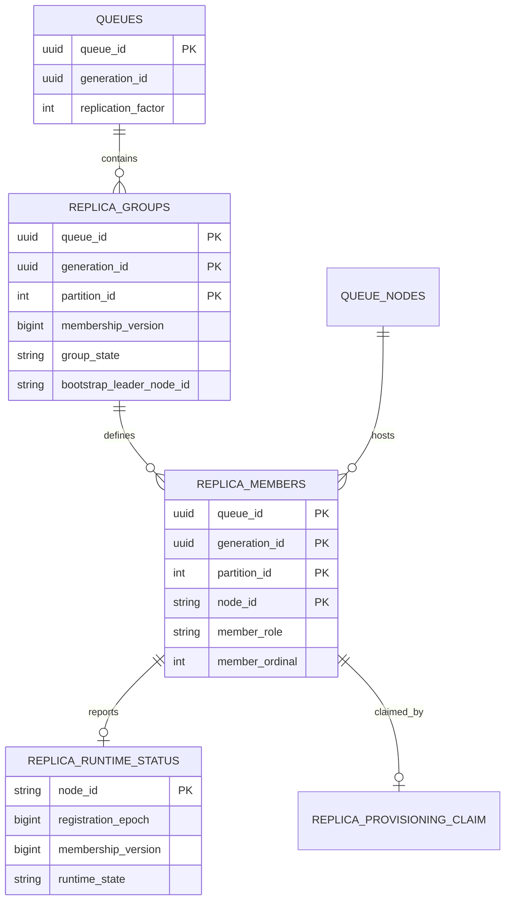
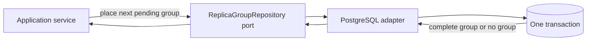
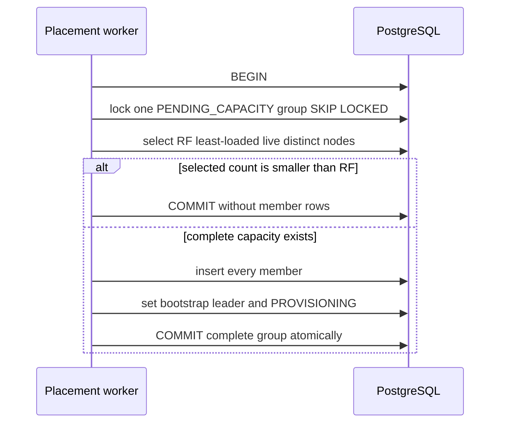
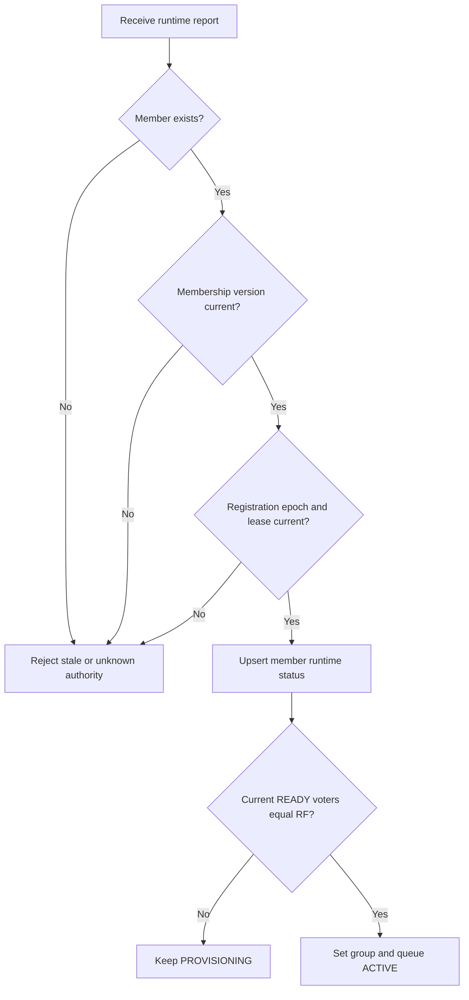
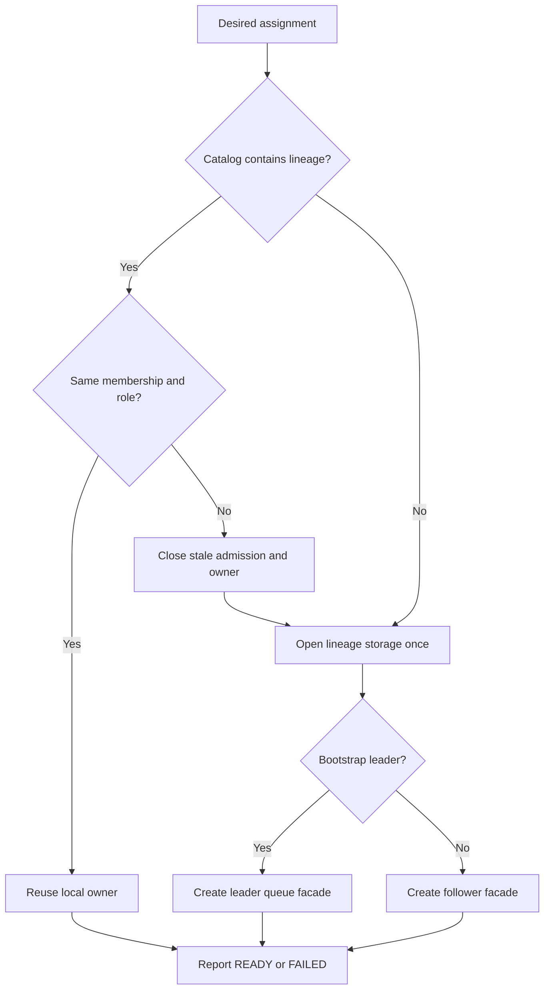

# v0.29 Low-Level Design — Replica Membership and Placement

## Status

Implemented in v0.29. This document records the resulting design.

## Existing model that must change

The current tables have these single-node keys:

```text
queue_partition_placements primary key
    (queue_id, generation_id, partition_id)

queue_partition_runtime_status primary key
    (queue_id, generation_id, partition_id)

queue_provisioning_claims primary key
    (queue_id)
```

Those keys cannot describe several replicas. v0.29 should introduce explicit
replica-group tables through a new Flyway migration. Existing migrations remain
immutable.

```text
Old key

(queue, generation, partition) ------------> one node

New keys

(queue, generation, partition) ------------> one replica group
                                                     |
                                                     +-- node-a
                                                     +-- node-b
                                                     `-- node-c

(queue, generation, partition, node) ------> one member/status
```

## Proposed database model

### Queue replication factor

Add to `queues`:

```sql
replication_factor INTEGER NOT NULL DEFAULT 3
```

Constraints proposed for review:

```text
1 <= replication_factor <= configured API maximum
```

The database should enforce a fixed absolute safety maximum; application
configuration may enforce a lower operational maximum.

### `queue_partition_replica_groups`

One row describes group-wide desired state:

```sql
CREATE TABLE queue_partition_replica_groups (
    queue_id UUID NOT NULL,
    generation_id UUID NOT NULL,
    partition_id INTEGER NOT NULL,
    replication_factor INTEGER NOT NULL,
    membership_version BIGINT NOT NULL,
    group_state VARCHAR(32) NOT NULL,
    bootstrap_leader_node_id VARCHAR(255),
    created_at TIMESTAMPTZ NOT NULL,
    updated_at TIMESTAMPTZ NOT NULL,
    PRIMARY KEY (queue_id, generation_id, partition_id)
);
```

Proposed states:

```text
PENDING_CAPACITY
PROVISIONING
ACTIVE
PROVISIONING_FAILED
```

Rules:

- replication factor is positive and matches the queue generation;
- membership version starts at one;
- bootstrap leader is absent while pending capacity;
- bootstrap leader is present for provisioning and active groups;
- v0.29 never increments membership version after group creation.

### `queue_partition_replicas`

One row per desired member:

```sql
CREATE TABLE queue_partition_replicas (
    queue_id UUID NOT NULL,
    generation_id UUID NOT NULL,
    partition_id INTEGER NOT NULL,
    membership_version BIGINT NOT NULL,
    node_id VARCHAR(255) NOT NULL,
    member_role VARCHAR(16) NOT NULL,
    member_ordinal INTEGER NOT NULL,
    created_at TIMESTAMPTZ NOT NULL,
    PRIMARY KEY (
        queue_id,
        generation_id,
        partition_id,
        node_id
    ),
    UNIQUE (
        queue_id,
        generation_id,
        partition_id,
        member_ordinal
    )
);
```

Roles:

```text
VOTER
LEARNER
```

All initial rows are voters. `member_ordinal` records deterministic selection
order and does not imply replication priority after election exists.

### `queue_partition_replica_runtime_status`

Observed state is member-scoped:

```sql
CREATE TABLE queue_partition_replica_runtime_status (
    queue_id UUID NOT NULL,
    generation_id UUID NOT NULL,
    partition_id INTEGER NOT NULL,
    node_id VARCHAR(255) NOT NULL,
    membership_version BIGINT NOT NULL,
    registration_epoch BIGINT NOT NULL,
    runtime_state VARCHAR(16) NOT NULL,
    failure_reason VARCHAR(2048),
    updated_at TIMESTAMPTZ NOT NULL,
    PRIMARY KEY (
        queue_id,
        generation_id,
        partition_id,
        node_id
    )
);
```

Initial runtime states remain `READY` and `FAILED`. Absence means the member has
not reported for the current authority.

### Entity relationship



### Replica provisioning claim

Provisioning work must be scoped by node member, not queue only:

```text
identity = queue + generation + partition + node + membership version
authority = node registration epoch + claim fencing token
```

The existing queue-wide claim table cannot safely represent concurrent
provisioning of three members. The implementation should either introduce a
new replica-scoped claim table or replace the existing table in the new schema.
The preferred design is a new table so prior Flyway history remains readable.

## Why group and member are separate tables

The group owns facts that must change together:

```text
requested count
membership version
group lifecycle
bootstrap leader
```

Member rows own repeated facts:

```text
node
role
stable ordinal
```

Putting everything in member rows would duplicate group state and allow three
rows to disagree about membership version or bootstrap leadership.

```text
Replica group row                 Replica member rows
-----------------                 -------------------
RF = 3                            node-a, VOTER, ordinal 0
membership version = 1            node-b, VOTER, ordinal 1
state = PROVISIONING              node-c, VOTER, ordinal 2
bootstrap leader = node-a

One group fact is stored once. Repeated member facts are stored per node.
```

## Domain model

Proposed values:

```java
record ReplicaGroupId(
        UUID queueId,
        UUID generationId,
        int partitionId
) {}

enum ReplicaGroupState {
    PENDING_CAPACITY,
    PROVISIONING,
    ACTIVE,
    PROVISIONING_FAILED
}

enum ReplicaMemberRole {
    VOTER,
    LEARNER
}

record ReplicaMember(
        String nodeId,
        ReplicaMemberRole role,
        int ordinal
) {}

record PartitionReplicaGroup(
        ReplicaGroupId id,
        int replicationFactor,
        long membershipVersion,
        ReplicaGroupState state,
        Optional<String> bootstrapLeaderNodeId,
        List<ReplicaMember> members
) {}
```

Node-side assignment:

```java
record ReplicaAssignment(
        StorageLineage lineage,
        long membershipVersion,
        ReplicaMemberRole role,
        boolean bootstrapLeader
) {}
```

Do not reuse `placementEpoch` as membership version. A placement epoch fenced
one serving-node placement; membership version identifies one complete replica
configuration.

## Repository ports

Metadata application ports should express domain operations, not SQL:

```java
interface ReplicaGroupRepository {
    Optional<PartitionReplicaGroup> placeNextPendingGroup(
            Instant now,
            Duration nodeLeaseSafetyMargin
    );

    List<ReplicaAssignment> assignmentsFor(NodeLeaseIdentity node);

    PartitionReplicaGroup publishRuntimeStatus(
            ReplicaRuntimeReport report
    );

    Optional<PartitionReplicaGroup> find(ReplicaGroupId id);
}
```

The transaction for initial placement belongs in one repository operation
because selecting nodes and publishing the group must be atomic.



## Initial placement transaction

Pseudo-SQL flow:

```sql
BEGIN;

-- Claim one group without blocking another planner.
SELECT ...
FROM queue_partition_replica_groups
WHERE group_state = 'PENDING_CAPACITY'
ORDER BY created_at, queue_id
FOR UPDATE SKIP LOCKED
LIMIT 1;

-- Select enough live nodes and balance by desired replica count.
SELECT n.node_id
FROM queue_nodes n
LEFT JOIN queue_partition_replicas r
  ON r.node_id = n.node_id
WHERE n.lease_expires_at > :safe_now
GROUP BY n.node_id
ORDER BY COUNT(r.node_id), n.node_id
LIMIT :replication_factor;

-- If count is too small: COMMIT with no membership mutation.

-- Otherwise insert every member and update the group in this transaction.
INSERT INTO queue_partition_replicas ...;

UPDATE queue_partition_replica_groups
SET group_state = 'PROVISIONING',
    bootstrap_leader_node_id = :first_selected_node,
    updated_at = :now
WHERE ... AND group_state = 'PENDING_CAPACITY';

COMMIT;
```

The live-node safety margin prevents selecting a lease that is about to expire
during the placement transaction. It does not guarantee the node stays alive
after commit.



## Concurrency behavior

Two metadata-service instances may run the planner concurrently:

```text
planner A locks group X
planner B skips X and selects group Y
```

For one group, member rows and the group transition commit atomically. There is
never an externally visible group containing only one or two of three intended
members.

Node load can change between concurrent placement transactions. Exact global
balance is not an invariant. Distinct membership and complete group size are
invariants.

```text
Planner A                         Planner B
---------                         ---------
locks group X                     skips locked X
selects nodes                     locks group Y
inserts X members                 selects nodes
commits X                         inserts Y members

Allowed: small load imbalance caused by concurrent database views.
Forbidden: duplicate node inside X or a partial X member set.
```

## Assignment API

Proposed endpoint:

```http
GET /internal/v1/nodes/{nodeId}/replica-assignments
    ?registrationEpoch={epoch}
```

Example response:

```json
[
  {
    "queueId": "...",
    "generationId": "...",
    "partitionId": 0,
    "membershipVersion": 1,
    "memberRole": "VOTER",
    "bootstrapLeader": false
  }
]
```

The metadata service validates that `(nodeId, registrationEpoch)` identifies a
current live registration before returning assignments.

## Provisioning completion and runtime status

v0.29 extends the existing fenced provisioning API instead of adding a second
direct runtime-report endpoint. Each replica member owns an independent claim:

```http
POST /internal/v1/provisioning/claims
POST /internal/v1/provisioning/claims/{queueId}/complete
POST /internal/v1/provisioning/claims/{queueId}/fail
```

The completion body carries generation, partition, node, registration epoch,
membership version, and fencing token. A successful completion records the
member's `READY` status; failure records `FAILED` and fails the group.

The conditional write succeeds only if:

- the member row exists;
- membership version matches;
- node registration epoch matches the current node row;
- the node lease has not expired;
- READY has no failure reason;
- FAILED has a bounded failure reason.

After accepting a READY completion, the same transaction activates the group if
the count of current READY members equals the replication factor.



## Public create API

Proposed request addition:

```json
{
  "queueName": "orders",
  "replicationFactor": 3
}
```

Omitting `replicationFactor` means three. It becomes part of the idempotency
request hash; retrying the same idempotency key with a different value is a
conflict.

## Node reconciliation

The existing provisioning reconciler polls one node-scoped claim at a time.
The repository returns work only when that node is a current member, so the
node cannot materialize an unassigned replica through this flow. Repeated polls
eventually materialize every assigned member; the assignment API separately
provides the complete desired-state view needed by automatic catch-up in the
next milestone.

For each claimed assignment:

```text
if bootstrap leader
    open LocalMessageQueue using LocalPartitionStorageLayout
else
    open follower ReplicatedLog using the same layout
```

Use one node-local catalog keyed by `StorageLineage` so leader and follower
components cannot independently open the same WAL. A role-specific wrapper may
sit above one exclusive storage handle.

```text
ReplicaAssignment
        |
        v
NodeLocalReplicaCatalog[StorageLineage]
        |
        +-- bootstrap leader role --> LocalMessageQueue facade
        |
        `-- follower role ---------> FollowerReplicaLog facade
                                      |
                                      `-- both use ONE owned WAL handle
```



Do not perform HTTP or metadata calls while holding a partition operation lock.
Open/close transitions remain background lifecycle work. Data-plane operations
continue through the existing admission handle.

## Route resolution

For v0.29 the public route remains the bootstrap leader, but only when:

```text
group ACTIVE
AND bootstrap leader member READY
AND bootstrap leader node lease current
```

Follower endpoints are available from member-to-node joins for later automatic
catch-up. They are not exposed as customer routes.

## Existing-table transition

Implementation planning must explicitly choose how old single-placement rows
are retired. Recommended for this learning repository:

1. Add new replica-group tables in a new migration.
2. Stop writing new rows to `queue_partition_placements` and the old runtime
   table once the new application code is active.
3. Do not implement production data migration for old rows.
4. Document that a clean development database is required for v0.29.
5. Remove obsolete application paths only after all callers use replica-group
   ports.

Do not edit old Flyway migration files.

## Tests required before implementation acceptance

### Domain tests

- replication factor bounds;
- member count and distinct-node invariant;
- exactly one bootstrap leader from voter members;
- immutable membership version;
- status/failure-reason consistency.

### PostgreSQL integration tests

- complete RF=3 group inserted atomically;
- insufficient nodes inserts no partial members;
- least-loaded selection and stable tie-break;
- concurrent planners cannot duplicate a group;
- stale registration epoch cannot fetch or report;
- stale membership version cannot report;
- group activates only after every member is ready;
- queue-create idempotency includes replication factor.

### Node tests

- node opens every assigned local replica once;
- restart reopens the same lineage storage;
- leader and follower adapters cannot own the same WAL simultaneously;
- removed/stale assignment closes admission before storage;
- local recovery failure reports FAILED and never READY.

### End-to-end test

With three registered nodes, creating one queue produces three distinct local
replica directories and activates only after all three report ready. This test
does not assert automatic record replication.

## Benchmark decision

No message-throughput benchmark is required because v0.29 must not change the
message hot path. Add a metadata benchmark only if placement queries show
material cost under thousands of nodes or assignments. At minimum, record an
integration-test timing for assignment lookup by node and verify the supporting
indexes with `EXPLAIN ANALYZE` before release.

## Implementation order after design approval

```text
Flyway schema
    -> metadata domain values and ports
    -> placement transaction tests
    -> repository implementation
    -> internal APIs
    -> node assignment model and client
    -> unified local replica lifecycle
    -> route/readiness integration
    -> end-to-end tests
    -> documentation and release
```
