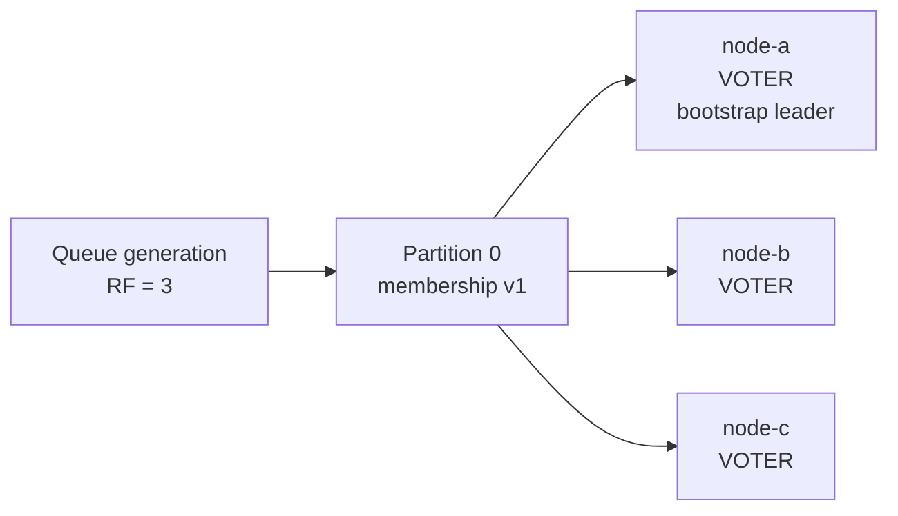
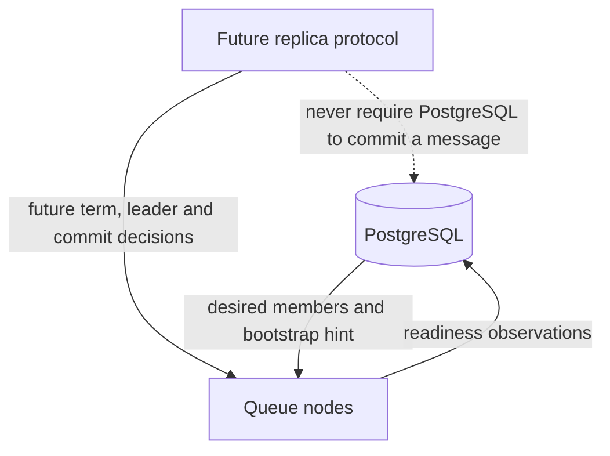
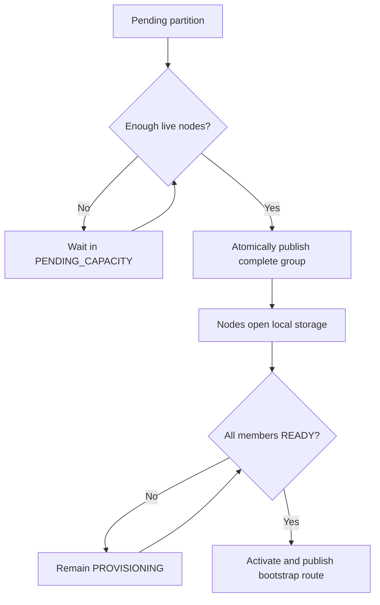

# v0.29 Problem and Proposed Solution — Replica Membership and Placement

## Status

Implemented in v0.29 after joint design review.

## The problem in simple terms

The queue can store a follower WAL and can send one bounded batch to a known
follower endpoint. It does not know which nodes are supposed to be replicas of
a partition.

Today the metadata model says:

```text
partition 0 -> one placed node
```

The distributed target needs:

```text
partition 0 -> one replica group -> several distinct nodes
```

Without that group, automatic replication has no safe answer to these
questions:

- Which followers should receive an entry?
- Is a node an intended member or an accidental/stale caller?
- How many copies did the customer request?
- May two replicas of the same partition be placed on one node?
- Which local replicas should a restarting node open?
- When is the initial group fully provisioned?

### Current gap

```text
CURRENT

                    caller supplies URI
                           |
                           v
Leader source ----> ReplicaCatchUpService ----HTTP----> Follower WAL
     |                                                    |
     |                                                    |
     `-- no member list                      accepts a valid bounded batch


MISSING AUTHORITY

partition 0 ---> [ which nodes belong here? ] ---> unknown
```

The arrows for copying data exist. The box that defines the intended nodes does
not.

## Current pain points

### 1. One placement row means one copy

`queue_partition_placements` has one primary-key row for a queue generation and
partition. It cannot represent three nodes for the same partition.

### 2. Replication is manually addressed

`ReplicaCatchUpService.runOnce` requires a caller to supply the follower URI,
term, and next sequence. No production coordinator discovers members and calls
it continuously.

### 3. Queue creation has no durability intent

The queue definition records partition count but not replication factor. The
system cannot distinguish a deliberately single-copy queue from a queue that
requested three copies but currently has only one.

### 4. Assignment and readiness are conflated around one serving node

The existing runtime status identifies the node serving a partition. A replica
group needs separate answers for desired membership and observed local
readiness.

### 5. Unsafe repair would be tempting

If a node disappears, immediately replacing it looks helpful. It is unsafe
before learner catch-up, promotion, and membership-change rules exist. A new
empty replica must not be treated as an up-to-date voting copy.

## Proposed solution

Add an authoritative, immutable initial replica group for each partition.

Example:

```text
queue: orders
generation: G1
partition: 0
replication factor: 3
membership version: 1

node-a -> VOTER, bootstrap leader
node-b -> VOTER
node-c -> VOTER
```



Membership and leadership are separate concepts:

```text
membership role
    VOTER or LEARNER

bootstrap leader
    the one initial serving node selected before node-led election exists
```

`VOTER` is future election eligibility. v0.29 does not implement voting,
election, or majority commit.

## Authority boundaries

```text
PostgreSQL metadata
    owns requested replication factor
    owns desired replica membership
    owns membership version
    owns initial bootstrap-leader choice

Queue nodes
    own local WAL, snapshot, and hard-state files
    report whether assigned storage opened successfully

Replica protocol
    later owns log catch-up and quorum progress
```

PostgreSQL must not decide whether a WAL entry is committed and must not be in
the future publish acknowledgement path.



## Placement policy

For an initial group:

1. Select only live, eligible node registrations.
2. Count each node's existing desired replicas.
3. Order by replica count, then stable node ID.
4. Select exactly `replicationFactor` distinct nodes.
5. Insert the complete group in one database transaction.
6. Choose the first selected node as bootstrap leader.

The tie-break makes retries and tests understandable. It is not a claim of
optimal rack, zone, disk, or network placement.

```text
Live nodes before placement

node       desired replicas       selection order
----       ----------------       ---------------
node-b             7                     1
node-d             7                     2   (node ID tie-break)
node-c             8                     3
node-a            10                     4

RF=3 selects: node-b, node-d, node-c
```

## Insufficient capacity

If replication factor is three and only two eligible nodes exist:

```text
queue/generation exists
partition group status = PENDING_CAPACITY
replica member rows = none
```

The system must not silently create a two-copy group. A later reconciliation
attempt may place the complete group after another node registers.

## Provisioning and activation

```text
PENDING_CAPACITY
        |
        | enough live nodes; complete group inserted atomically
        v
PROVISIONING
        |
        | every assigned node reports its local replica READY
        v
ACTIVE
```

The queue does not serve data-plane traffic until every initial replica has
opened lineage-correct storage. This prevents accepting messages before the
initial empty group exists everywhere.



This does not yet make accepted messages replicated. Until automatic catch-up
and majority commit are implemented, publish acknowledgement remains local to
the bootstrap leader.

## Desired state and observed state

Keep two kinds of records:

```text
desired member
    node-c should store this replica

observed runtime status
    node-c opened this replica and reports READY
```

An assignment is never proof of readiness. A readiness report is accepted only
when its node incarnation and membership version still match current metadata.

## Node-local ownership

A node receives replica assignments for its current registration incarnation.
For each assignment it opens exactly one local storage owner:

```text
bootstrap leader assignment
    -> LocalMessageQueue runtime

non-leader replica assignment
    -> follower ReplicatedLog runtime
```

Both use the same lineage directory. They must not be opened simultaneously by
two local components because the WAL lock represents exclusive ownership.

## Failure behavior deliberately chosen for v0.29

- Before membership exists, insufficient nodes leave the group pending.
- After membership is inserted, it is immutable for this milestone.
- A member failure makes the group unavailable or degraded; it does not trigger
  automatic replacement.
- A stale node incarnation cannot publish readiness.
- A partially provisioned group cannot activate.
- Recovery of the same assigned node is idempotent.

Immutability keeps the milestone safe. Dynamic replacement requires snapshot
transfer, catch-up, learner promotion, and safe membership change.

## What this milestone solves

It gives later replication workers one inspectable answer to:

> Which nodes are the intended replicas of this partition?

It also makes requested replication factor explicit and prevents the queue
from claiming initial readiness before the complete empty replica group exists.

## What it does not solve

- automatic WAL replication;
- snapshot transfer;
- majority acknowledgement;
- leader election;
- automatic replacement or rebalancing;
- rack or zone awareness;
- changing replication factor;
- multiple customer partitions.

## Decisions accepted during brainstorming

1. Insufficient capacity remains pending rather than weakening durability.
2. Membership uses `VOTER`/`LEARNER`; bootstrap leadership is separate.
3. Every initial replica must be provisioned before activation.
4. Initial membership is immutable during v0.29.
5. Placement uses least-loaded eligible nodes with node ID as tie-breaker.

## Open questions for joint review

1. Should a replica reporting `FAILED` move the queue to
   `PROVISIONING_FAILED`, or leave it in `PROVISIONING` for bounded retry?
2. Should the public create API allow replication factor 1 and 2, or require
   odd factors while consensus is still absent?
3. Should the bootstrap leader be represented by a member flag or a node ID on
   the replica-group row?
4. What upper bound should the metadata API enforce for replication factor?
