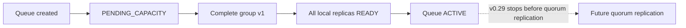

# v0.29 Semantics — Replica Membership and Placement

## Status

Implemented and verified in v0.29.

## Terms

### Replication factor

The requested number of voting replicas for every partition in one queue
generation.

### Replica group

The complete desired member set for one queue generation and partition.

### Membership version

A positive number identifying one complete replica configuration. Version one
is the immutable initial configuration in v0.29.

### Voter

A member intended to participate in future quorum and election decisions.
v0.29 stores the role but does not yet implement voting.

### Learner

A non-voting member intended to catch up before future promotion. The role is
reserved in v0.29; initial groups contain voters only.

### Bootstrap leader

The one initial voter used for routing before node-coordinated election exists.
It is a temporary leadership hint, not a consensus election result.

### Desired assignment

Metadata stating that a node should own local storage for a replica.

### Runtime readiness

A fenced observation that the current node process opened and recovered the
assigned local storage.

```text
Durable desired state                     Rebuildable observation
---------------------                     -----------------------
replication factor                        node registration lease
replica member set                        local replica READY/FAILED
membership version                        last readiness report time
bootstrap leader

Desired state says what should exist. Observation says what exists now.
```

## Guarantees

### S1. Explicit replication intent

Every newly created queue generation has one replication factor. Omission from
the create request means three.

### S2. No silent under-replication at initial placement

A replica group is published only when exactly the requested number of distinct
eligible nodes can be selected. Otherwise it remains pending with no partial
member set.

### S3. One replica per node per partition

A node may appear at most once in one replica group.

### S4. Atomic group publication

Other transactions observe either no members or the complete initial member
set. They do not observe a partially inserted group.

### S5. Stable initial membership

After the initial group is published, v0.29 does not automatically add, remove,
replace, or reorder members.

### S6. Membership is lineage-scoped

Every member belongs to exactly one queue ID, generation ID, and partition ID.
Storage opened for another lineage cannot satisfy the assignment.

### S7. Leadership is separate from membership

Exactly one initial voter is the bootstrap leader. Other voters do not serve
the public route merely because they are members.

### S8. Assignment is not readiness

The existence of a member row does not prove that its node created, opened, or
recovered local storage.

### S9. Fenced readiness

A runtime report changes current observed state only when node ID,
registration epoch, lineage, and membership version match current metadata.

### S10. Complete initial readiness before activation

The group becomes active only after every initial voter has current READY
status.

### S11. Deterministic selection among observed candidates

Given the same database snapshot, placement orders eligible nodes by desired
replica count and then node ID. Concurrent transactions are allowed to produce
small temporary load differences; exact global balance is not guaranteed.

### S12. Idempotent reconciliation

Repeated assignment fetch, local open, and identical readiness publication do
not create duplicate member rows or duplicate local storage owners.

### S13. PostgreSQL is not message commit authority

Replica membership and readiness metadata do not prove that a message entry
has been replicated or committed.



## Explicit non-guarantees

v0.29 does not guarantee:

- automatic replication from bootstrap leader to followers;
- majority-durable publish acknowledgement;
- follower state-machine application;
- automatic leader election;
- automatic failover;
- replacement of failed members;
- dynamic replication-factor changes;
- rack, zone, host, disk, or region separation;
- perfectly even placement;
- service continuity during metadata loss;
- multiple partitions per customer queue.

## Assumptions

- Node IDs represent distinct failure units for this milestone.
- Registered node endpoints are reachable by other queue nodes in the intended
  deployment network.
- Node registration leases are based on the metadata service's database time.
- Internal APIs are accessible only within a trusted environment until node
  authentication is implemented.
- A clean development database is acceptable for the schema transition.
- Initial groups are formed before any queue data-plane mutation is accepted.

## Required invariants

```text
replicationFactor >= 1
membershipVersion == 1 in v0.29
memberCount is either 0 or replicationFactor
distinctNodeCount == memberCount
initialLearnerCount == 0
bootstrapLeaderCount is 0 while pending, otherwise 1
bootstrapLeader is a member
bootstrapLeader role == VOTER
ACTIVE implies currentReadyVoterCount == replicationFactor
commitIndex remains unrelated to metadata readiness
```

### Valid and invalid examples

```text
VALID PENDING
RF=3, members=0, bootstrap leader absent

VALID PROVISIONING
RF=3, members={A,B,C}, bootstrap leader=A, ready={A,B}

VALID ACTIVE
RF=3, members={A,B,C}, bootstrap leader=A, ready={A,B,C}

INVALID
RF=3, members={A,B}
RF=3, members={A,A,C}
bootstrap leader=D, members={A,B,C}
ACTIVE with ready={A,B}
```

## Customer-visible meaning

An active v0.29 queue means:

> The requested initial replica storage exists and recovered successfully on
> the configured number of distinct nodes, and one bootstrap node can serve the
> current local-durability data path.

It does not mean:

> Every acknowledged message is already present on a majority of those nodes.

That stronger statement belongs to automatic replication and majority-commit
milestones.

## Decisions still open

- Whether replication factor two is allowed despite offering no additional
  majority failure tolerance over one node.
- The absolute maximum replication factor.
- Whether local provisioning failure is retryable indefinitely or terminal.
- Whether degraded health is computed or stored.
