# v0.30 Design — Event-Driven Control Plane, Multi-Raft, and Runtime Target

## Status

Proposed for joint design review. This document describes the complete target
architecture. The next milestone boundary is the event-driven provisioning
control plane: PostgreSQL outbox CDC, etcd projection, node sessions, and
per-node assignment watches. Multi-Raft remains the following data-plane
boundary and is included here so the control plane is not designed in isolation.
This document does not authorize implementation or claim that the described
distributed guarantees exist today.

## How this document is organized

- Sections 1–5 define the problem, proposed solution, goals, non-goals,
  high-level authority model, and programming-language decision.
- Sections 6–19 provide the low-level partition, command, storage, lifecycle,
  recovery, failure, observability, and security design.
- Sections 20–21 capture open design decisions and the required review outcome.

## 1. Target architecture summary

The target has an event-driven control plane and a partitioned Multi-Raft data
plane:

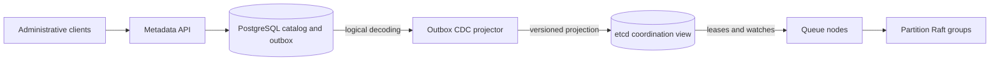

PostgreSQL is the durable catalog and desired-state authority. etcd is the
low-latency coordination and distribution view. Queue nodes do not poll
PostgreSQL for provisioning. They watch versioned etcd prefixes and reconcile
assignments idempotently. Partition Raft groups remain independent of both
stores for message leadership and commit.

## 2. Proposed solution

Use one Raft group per partition, hosted by a shared Multi-Raft runtime. Extract
a deterministic queue state machine from the local storage wrapper. Route every
distributed mutation through the partition leader, apply it only after majority
commit, and place each local replica on one stable named storage volume.

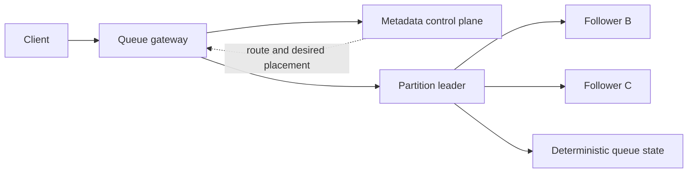

The dotted control-plane relationship is not part of message commit. The solid
leader-to-follower relationships establish partition durability.

## 3. Goals

- Introduce immutable `partitionCount` per queue generation.
- Define deterministic keyed and unkeyed partition selection.
- Define one stable Raft group identity per partition lineage.
- Host many independent groups in one queue-node process using shared bounded
  resources.
- Make Go the language for new project-owned control-plane and data-plane code.
- Make Dragonboat the leading Multi-Raft candidate behind project-owned ports,
  subject to storage, release, safety, and density proof-of-concept gates.
- Separate deterministic queue state transitions from WAL ownership.
- Define majority-durable, committed-only application semantics.
- Define leader-driven deterministic delivery timeout processing.
- Model multiple named storage volumes and stable replica binding.
- Remove PostgreSQL registration lease from the eventual message-serving
  authority chain.
- Establish measurable proof-of-concept gates before public distributed writes.
- Make the programming-language choice explicit for each deployable instead of
  inheriting it accidentally from the current repository or a reference RFC.

## 4. Non-goals for the foundation milestone

- Publicly claiming production-ready distributed publish or receive.
- Dynamic partition-count changes.
- Queue-wide total ordering across partitions.
- Automatic split, merge, or repartitioning.
- Cross-region consensus.
- Exactly-once processing or distributed transactions.
- Automatic failed-voter replacement in the first implementation.
- Shared per-disk journal or cross-partition group commit.
- Migrating existing local storage formats.
- Replacing PostgreSQL as tenant and desired-placement authority.
- Maintaining Java and Go as two production implementations of queue semantics.
- Preserving the existing Java WAL or snapshot binary format; this learning-stage
  system has no production data requiring an online format migration.

## 5. Architectural authority model

| Decision or state | Authority |
|---|---|
| Tenant, queue name, generation | PostgreSQL metadata |
| Partition count and routing algorithm | PostgreSQL queue-generation configuration |
| Desired replica hosts | PostgreSQL placement intent |
| Local replica volume | Durable replica binding on the assigned queue node; observed by metadata |
| Current term and vote | Raft group's durable hard state |
| Current leader | Raft quorum |
| Ordered command history | Raft log |
| Commit index | Raft quorum |
| Queue state through `lastApplied` | Deterministic state machine plus snapshot |
| Customer publish success | Leader after majority commit and required local application |
| Node capacity and health observation | Queue node reported to metadata |

```text
Control plane says:
  where a replica should exist

Raft group says:
  who may lead and which commands are committed

State machine says:
  what committed commands mean for queue behavior
```

No one authority substitutes for another.

### 5.1 Control-plane technology evaluation

The data-plane consensus choice and the control-plane storage choice solve
different problems:

```text
Control plane
  tenant catalog, queue configuration, desired placement, discovery,
  provisioning intent, node inventory

Data plane
  current leader, ordered commands, durable majority, commit index,
  applied queue state
```

Using etcd or ZooKeeper for control-plane coordination does not remove the need
for one Raft group per queue partition. Conversely, embedding Raft in queue
nodes does not provide tenant catalog queries, idempotent queue creation, or
capacity-based placement.

#### Options

| Property | PostgreSQL | etcd | ZooKeeper |
|---|---|---|---|
| Primary model | Relational tables and transactions | Versioned key/value ranges | Hierarchical znodes |
| Consensus | Supplied by the database deployment, not this application | Raft | Zab |
| Strong use cases here | Tenant catalog, idempotency, lifecycle, placement queries | Leases, watches, small coordination records, change notification | Sessions, ephemeral nodes, watches, coordination recipes |
| Assignment notification | Polling, long polling, outbox, or database notification | Revisioned streaming watches | Watches; client must handle reconnect and watch semantics |
| Liveness primitive | Application-owned lease rows and conditional updates | Native leases with keep-alive | Ephemeral znodes bound to sessions |
| Query flexibility | Strong relational joins, constraints, and aggregation | Key/range access; secondary indexes are application-owned | Tree/path traversal; indexes are application-owned |
| Operational effect | Existing dependency and source of truth | Adds a second quorum service | Adds a second JVM quorum service |
| Main risk | Poll amplification and database availability affecting control-plane work | Dual authority, watch storms, hot key ranges, another quorum to operate | Session tuning, watch storms, JVM pauses, another quorum to operate |
| Message commit role | None | None | None |

etcd watches stream key-range changes from a revision and its leases remove
attached keys after missed keep-alives. These are a better natural fit for node
presence and assignment-change notification than one-second polling. A watch is
still not application authority by itself: reconnecting clients must resume
from a known revision or perform a fresh snapshot read before processing later
events.

ZooKeeper provides versioned znodes, ephemeral nodes, and watches. It can solve
the same broad coordination problems, normally through established recipes
rather than hand-built watch logic. Its session timeout must be chosen against
real JVM pause and network-delay measurements; a pause that loses a session can
remove ephemeral ownership even though the process later resumes.

#### Option A: keep PostgreSQL as the complete control plane

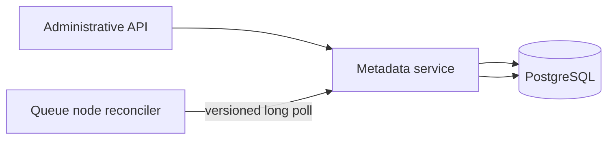

Improve the current design with versioned long polling, route caching, indexed
queries, and an outbox before introducing another system.

Advantages:

- one durable control-plane authority;
- atomic relational invariants;
- no cross-store recovery protocol;
- existing code and operational model remain valid.

Risks:

- every node still maintains a control-plane connection or polling cycle;
- PostgreSQL failover and scaling remain operational requirements;
- high-frequency liveness writes can compete with administrative transactions;
- the application must implement efficient change distribution.

#### Option B: PostgreSQL catalog plus etcd coordination projection — selected

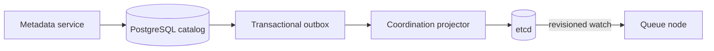

PostgreSQL remains canonical for queue configuration and desired membership.
The same database transaction records an outbox event. A projector publishes a
versioned materialized coordination view to etcd. Queue nodes watch that view
and reconcile idempotently.

This option is safe only if these rules are explicit:

1. no synchronous dual write to PostgreSQL and etcd;
2. every projection carries queue generation, membership version, and metadata
   version;
3. replaying an older projection cannot replace a newer node observation;
4. a watch gap or compacted revision causes a complete snapshot read;
5. etcd notification never changes committed Raft membership by itself;
6. failed projection delays provisioning but does not partially publish a new
   desired group;
7. already formed Raft groups continue independently of both stores while they
   retain quorum.

Potential benefits:

- efficient assignment and liveness watches;
- native short-lived node-presence keys;
- reduced empty polling against PostgreSQL;
- a compact coordination API independent of relational schema.

Costs:

- two quorum services and two backup, upgrade, security, and incident models;
- eventual delay between catalog commit and coordination visibility;
- new reconciliation rules for stale, missing, duplicated, and reordered
  projections;
- etcd capacity must be protected from large payloads and per-message traffic.

This is the selected target. PostgreSQL keeps transactional catalog authority;
etcd removes provisioning polling from queue nodes and provides lease-backed
node presence, revisioned assignment watches, controller election, and a small
operational routing view.

#### Option C: move the complete control plane to etcd

This would encode tenants, queues, idempotency, partitions, memberships, and
placement indexes as key ranges and compare-and-swap transactions.

It is not the proposed default. The current relational model benefits from
unique constraints, joins, transactional idempotency, and placement queries.
Moving it would require application-maintained secondary indexes and repair
logic without improving partition message consensus.

It may become reasonable only if the control-plane domain is deliberately
redesigned around small hierarchical keys and watch-first operation rather than
translated table by table.

#### Option D: use ZooKeeper for coordination

ZooKeeper is technically capable of node sessions, ephemeral registrations,
assignment watches, controller election, and versioned conditional updates.
It is not currently preferred for this greenfield system because etcd exposes a
more direct key/range, transaction, lease, and revisioned-watch model for the
same proposed coordination role.

ZooKeeper becomes a serious candidate when an organization already operates it,
requires integration with a ZooKeeper ecosystem, or has stronger operational
experience with its session and watch behavior. Choosing it only because older
distributed systems used it would not solve a repository-specific limitation.

#### Control-plane decision

```text
PostgreSQL
  remains canonical catalog and desired-placement authority

etcd
  becomes the coordination and desired-state distribution plane

PostgreSQL outbox CDC projector
  is the only PostgreSQL-to-etcd writer

Queue nodes
  watch etcd; they do not poll PostgreSQL for provisioning

ZooKeeper
  remains a valid but non-preferred coordination alternative

Partition Raft groups
  remain the only message leader and commit authority
```

No queue node reads the PostgreSQL catalog during its steady-state assignment
loop. Administrative writes can commit while the projector is unavailable;
their provisioning effect becomes visible after CDC catches up.

### 5.2 Event-driven control-plane HLD

#### Components

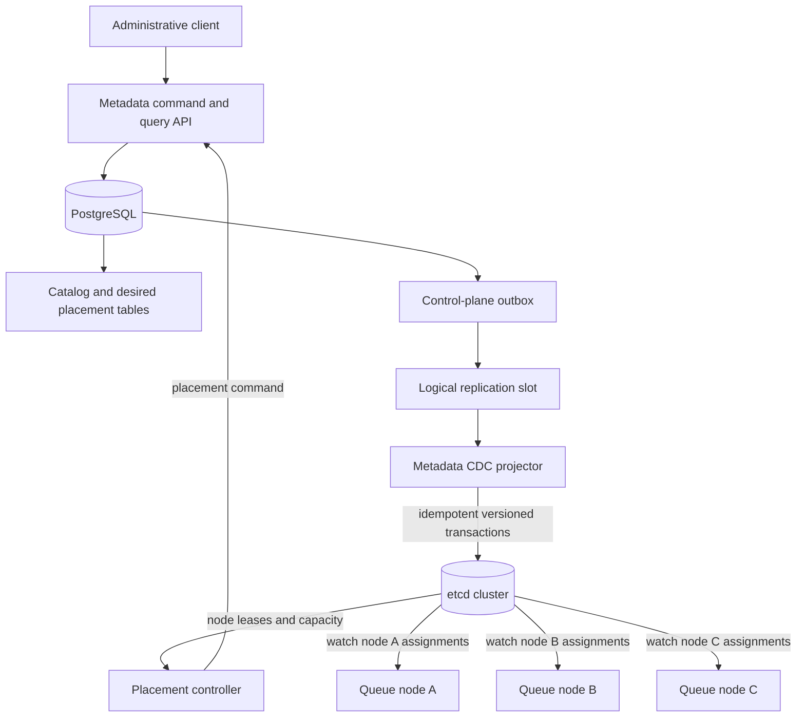

The metadata transaction writes domain state and one outbox event atomically.
The projector consumes committed outbox inserts through PostgreSQL logical
decoding. It acknowledges source progress only after the corresponding etcd
transaction succeeds.

The projector is not a generic table replicator. It consumes a versioned domain
event contract from the outbox so internal table changes do not silently alter
the etcd key model.

#### Deployable responsibilities

| Component | Responsibility |
|---|---|
| Metadata service | Validate administrative commands; transactionally change catalog/desired state and append outbox event |
| PostgreSQL | Canonical tenant, queue, partition, desired membership, and outbox authority |
| CDC projector | Consume one logical replication slot; convert outbox events into idempotent etcd transactions |
| etcd | Node sessions, capacity observations, controller election, desired-assignment projection, observed provisioning state, leader hints |
| Placement controller | React to pending partitions and live capacity; submit versioned placement commands to metadata service |
| Queue node | Maintain an etcd session; watch its assignment prefix; reconcile storage and Raft groups idempotently |
| Partition Raft group | Elect message leader and commit ordered queue commands independently of the control plane |

#### etcd key-space model

```text
/dq/v1/
  nodes/
    <nodeId>/
      session                 lease-bound, one current incarnation
      capacity                lease-bound, bounded operational summary

  desired/
    nodes/
      <nodeId>/
        groups/
          <raftGroupId>       persistent versioned replica assignment

  observed/
    nodes/
      <nodeId>/
        groups/
          <raftGroupId>       lease-bound runtime/provisioning observation

  routes/
    <queueId>/
      <partitionId>           lease-bound Raft leader hint, not authority

  controllers/
    placement                 lease-bound controller election

  projection/
    checkpoint                CDC projector diagnostic checkpoint
```

Customer payloads, Raft log entries, snapshots, and per-message state are never
stored in etcd.

#### Outbox event envelope

```text
ControlPlaneEvent
  eventId
  aggregateType
  aggregateId
  aggregateVersion
  eventType
  occurredAt
  payloadSchemaVersion
  payload
```

The aggregate version is monotonic for one projected entity. Re-delivering the
same event is harmless. An older event cannot overwrite a newer assignment.
Deletion is an explicit tombstone event rather than inference from missing CDC
fields.

Initial event types include:

```text
QueueGenerationCreated
PartitionGroupPendingCapacity
ReplicaMembershipAssigned
ReplicaMembershipRetired
QueueGenerationDeleting
QueueGenerationDeleted
```

Observed runtime status flows in the opposite direction through a command API
or a separate observed-state consumer. It is not inserted into the catalog by
the CDC projector that publishes desired state.

#### Queue creation and provisioning flow

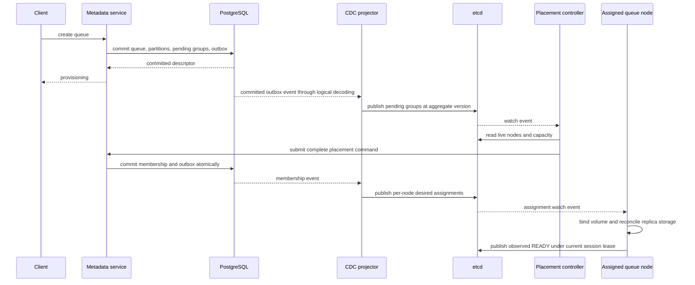

The placement controller never updates PostgreSQL directly. It submits a
command through the metadata boundary so domain validation, idempotency, and
outbox publication remain one transaction.

#### Node session and fencing

At startup a queue node grants an etcd lease and creates its session key using
a compare-and-set transaction that requires no current session for that node
ID. The immutable session value contains a random incarnation ID. The key's
creation revision and incarnation ID form the control-plane session fence.

```text
NodeSession
  nodeId
  incarnationId
  endpoint
  failureDomain
  startedAt

SessionFence
  incarnationId + sessionKeyCreateRevision
```

Desired assignments are persistent and survive node-session expiry. Observed
READY/FAILED keys are attached to the current node lease and disappear when
that incarnation loses its session.

A node publishes observed state with one etcd transaction that verifies:

```text
current session key still has this incarnation
AND desired assignment still has this membership version
AND desired assignment still names this node
```

Only then may etcd write the lease-bound observed key. This replaces the
cross-system race that would result from checking etcd and updating PostgreSQL
in separate transactions.

The observation informs control-plane readiness. It never grants Raft message
leadership. A paused old process cannot commit queue commands unless it also
holds current Raft authority and reaches a majority.

#### Assignment watch recovery

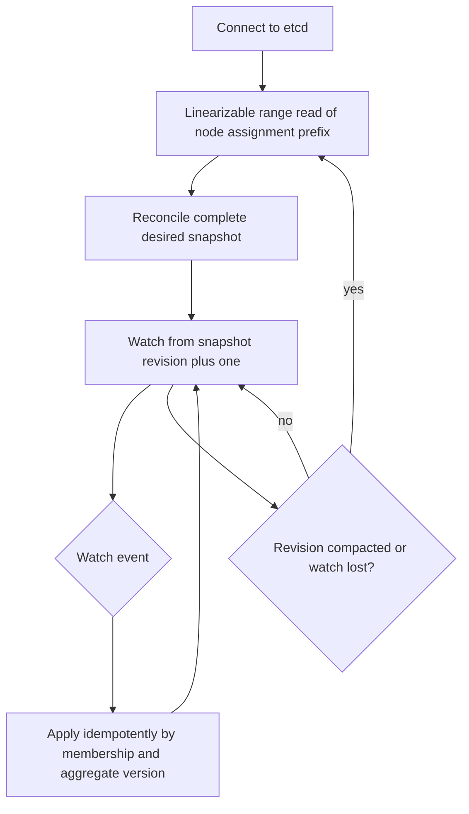

A watch is notification plus ordered revision progress, not a complete durable
local cache. After disconnect, compaction, or uncertain progress, the node
performs another full prefix read and reconciles additions and removals before
resuming the watch.

#### CDC delivery semantics

The PostgreSQL-to-etcd projection is at-least-once:

```text
read committed outbox event
    -> apply idempotent etcd transaction
    -> persist/ack source LSN
```

If the projector crashes after the etcd transaction but before acknowledging
the LSN, the event is delivered again and produces the same value. A single
active projector owns the replication slot; a standby may take over after
leader loss.

The logical replication slot retains PostgreSQL WAL while the projector is
down. Required monitoring includes retained WAL bytes, source LSN, acknowledged
LSN, event age, failed etcd transactions, and projection version lag. A bounded
retention policy must stop or throttle administrative writes before an
unavailable projector exhausts PostgreSQL storage.

#### Projection rebuild

etcd is a rebuildable coordination view. Disaster recovery does not replay an
unbounded historical outbox from the beginning:

```text
capture consistent PostgreSQL desired-state snapshot and source LSN
    -> write versioned etcd projection into a new key-space generation
    -> start CDC from the captured LSN
    -> catch up buffered events
    -> atomically publish the new projection generation pointer
    -> retire the old key-space generation
```

Queue nodes reconnect to the published generation, perform a full prefix read,
and resume watching. Existing Raft groups continue independently while the
coordination view is rebuilt.

#### Availability boundaries

| Failure | Existing quorate partitions | New provisioning | Administrative writes |
|---|---|---|---|
| PostgreSQL unavailable | Continue | Stop | Stop |
| etcd unavailable | Continue | Stop | May commit to PostgreSQL; projection waits |
| CDC projector unavailable | Continue | Delayed | May commit while retained-WAL bound permits |
| Placement controller unavailable | Continue | Pending groups wait | Queue create may commit as pending |
| One queue node unavailable | Unaffected groups continue; affected groups depend on their majority | Replacement waits for controller | Continue |

No control-plane component participates in a committed message's quorum.

#### Next milestone architecture boundary

The next milestone is complete when the production-shaped path is:

```text
metadata transaction + outbox
    -> PostgreSQL logical decoding
    -> idempotent etcd projection
    -> revision-safe per-node watch
    -> idempotent local replica provisioning
    -> lease-fenced observed readiness
```

Queue nodes no longer poll PostgreSQL for provisioning work. Existing local
queue behavior remains unchanged during this milestone. Partition Raft groups,
majority acknowledgement, multiplexed volume WAL, and multi-partition customer
routing begin only after this event-driven control-plane boundary is proven.

### 5.3 Programming-language evaluation

Go is selected for all new project-owned control-plane and data-plane code. This
is a deliberate system boundary, not an inference from etcd being written in Go
or from the Go examples in the control-plane RFC.

The current Java implementation remains a temporary executable reference for
queue semantics while the Go state machine is established. It will not remain a
second production implementation and it will not be called over JNI or a local
RPC bridge. `ENQUEUE`, `CLAIM`, `ACK`, `NACK`, lease expiry, retry, and DLQ
transitions ultimately have one production implementation: Go.

#### Runtime ownership in the target architecture

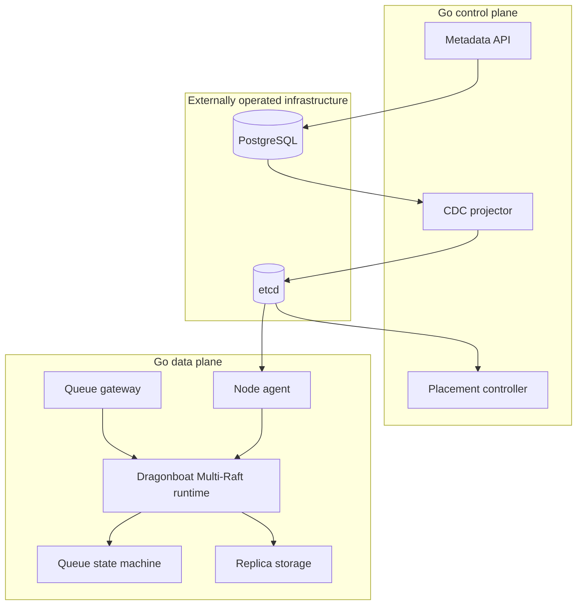

PostgreSQL and etcd retain their native runtimes. “Go control plane” and “Go data
plane” describe project-owned code, not a requirement to embed or fork either
external system.

#### Decision drivers

The relevant question is not which language wins a generic benchmark. It is
which language gives this system the safest path to a dense Multi-Raft runtime
with a durable queue state machine. The decision is based on:

1. ability to establish one production implementation of queue semantics;
2. availability and maturity of Multi-Raft candidates;
3. control over WAL, snapshot, buffer, thread, and backpressure behavior;
4. predictable latency and memory at high group density;
5. failure injection, profiling, observability, and operational support;
6. compatibility with PostgreSQL, CDC, etcd, gRPC, and Protobuf;
7. team learning cost and the number of build, release, and incident toolchains;
8. ability to change the consensus or storage implementation behind owned
   interfaces without rewriting customer-visible semantics.

#### Candidate evaluation

| Language | Strongest fit | Principal risks in this architecture | Decision |
|---|---|---|---|
| Go | Excellent etcd/controller ecosystem; simple deployment; goroutines and channels fit watch/reconciliation loops; Dragonboat explicitly targets Multi-Raft and exposes custom log-storage and transport boundaries | Requires a careful one-time port of queue semantics; goroutine and channel use still needs hard bounds; adopting Dragonboat also adopts substantial runtime and storage behavior; its stable-versus-development API line requires diligence | **Selected for all new project-owned services and the queue runtime** |
| Java 21 | Reuses `queue-core`; existing Maven tests and services; Apache Ratis and SOFAJRaft candidates; mature PostgreSQL, CDC, gRPC, metrics, profiling, and operational tooling | Keeping it would split the target from the chosen Go Multi-Raft ecosystem; retaining both implementations would create semantic drift and two operational stacks | Existing code is a temporary semantic reference, not the target runtime |
| Rust | No garbage collector; compile-time memory and concurrency safety; precise buffer and I/O ownership; `raft-rs` has production lineage | `raft-rs` supplies the consensus core, not the complete log, transport, and state machine; Multi-Raft assembly and async storage integration become project responsibilities; highest rewrite and delivery cost | Retain for a future storage/data-plane rewrite only with strong measured justification |
| C++ | Maximum low-level control and a broad native systems ecosystem | Manual memory-safety exposure, no compelling repository-aligned Multi-Raft candidate, highest correctness and maintenance burden | Rejected for this project |

The Go choice is concrete: new project-owned components use Go unless a recorded
ADR changes the decision. Individual modules may not select another language
for local convenience.

#### Why Go is selected now

Go makes the control plane and data plane one operational stack while aligning
with the strongest purpose-built Multi-Raft candidate. Goroutines and channels
fit watch streams, reconciliation, peer transport, and bounded scheduling, but
they are mechanisms rather than capacity controls. Every ingress path still
needs bounded queues, explicit byte limits, cancellation, overload responses,
and tenant fairness.

Dragonboat is attractive because it already models many Raft groups inside one
`NodeHost`, supplies snapshots and membership operations, shares execution and
transport resources, and permits custom `ILogDB` and transport implementations.
That is closer to the target than assembling group hosting, transport, storage,
and lifecycle around a consensus-core-only library.

Go does not eliminate garbage collection or pause risk. The queue node must
measure heap growth, allocation rate, GC CPU, stop-the-world pauses, goroutine
count, scheduler delay, and their effect on elections and tail latency. Message
payloads and replication buffers require pooling and ownership rules; pooling
must be bounded and must never allow reuse before asynchronous I/O completes.

#### Go implementation boundary

The existing Java services are not incrementally mixed into the final runtime.
The transition boundary is:

```text
repository semantics and Java behavior corpus
    -> versioned language-neutral command and result fixtures
    -> Go deterministic QueueStateMachine
    -> restart, lease, retry, and DLQ conformance tests
    -> Go control-plane and queue-node integration
    -> retire Java production modules after the Go path passes the gates
```

There is no production-data migration requirement. The Go implementation may
define a new WAL and snapshot format. It must preserve documented behavior and
durability invariants, not Java serialization or byte layout. Golden tests
compare externally visible results and restored semantic state, not identical
snapshot bytes.

#### Consensus-library decision within Go

Language selection does not automatically approve Dragonboat. The candidates
remain:

| Candidate | Fit | Cost or unresolved risk |
|---|---|---|
| Dragonboat | Complete Go Multi-Raft host, snapshots, membership changes, shared runtime, custom LogDB and transport hooks | Release-line health, custom storage complexity, operational behavior, and current maintenance activity must be verified |
| etcd/raft | Stable deterministic Raft core with broad production lineage | Network, disk I/O, Multi-Raft scheduling, snapshot transfer, group lifecycle, and resource sharing become this project's responsibility |
| HashiCorp Raft | Mature Go replicated-state-machine library | Primarily shaped around independently hosted Raft instances rather than high-density Multi-Raft; resource sharing requires proof |
| Custom Raft | Total control | Unacceptable initial correctness and maintenance burden |

Dragonboat is the leading candidate because this project needs an operating
Multi-Raft host, not only a correct Raft state machine. A focused proof of
concept must still prove group density, release viability, storage integration,
recovery, and failure behavior before dependency approval.

#### What would justify reconsidering Go

The language decision is reopened only if reproducible evidence shows that Go
cannot satisfy a required correctness or operational gate after reasonable
tuning. Evidence includes persistent GC or scheduler behavior that causes
election churn, inability to bound memory at required group density, or an
unresolvable storage-safety limitation across all acceptable Go designs.

A failed application-level throughput benchmark alone is not enough. The test
must identify the limiting layer. Fsync policy, replication RTT, serialization,
lock contention, batching, and queue semantics remain the same problems after a
language change.

#### Semantic port acceptance

The Go state machine must pass the same command histories and failure scenarios
as the current Java reference before it becomes authoritative:

```text
same command history
    -> Java reference result
    -> Go state-machine result
    -> externally visible result and semantic-state comparison
    -> fault/restart replay comparison
```

This is a temporary migration oracle, not permanent dual implementation. Once
the Go path is accepted, semantics documents and language-neutral fixtures—not
the Java code—become the authority for future changes.

## 6. Logical data model

### Queue generation

```text
QueueGeneration
  tenantId
  queueId
  generationId
  partitionCount
  replicationFactor
  routingAlgorithm
  routingSeed
  queueConfiguration
```

`partitionCount`, `routingAlgorithm`, and `routingSeed` are immutable within one
generation. Silent changes would remap a retry to another partition.

### Partition identity

```text
PartitionLineage
  queueId
  generationId
  partitionId
```

Valid partition IDs are in `[0, partitionCount)`.

### Raft group identity

Derive a stable UUID from the complete partition lineage using a specified,
versioned algorithm:

```text
raftGroupId = deriveGroupId(
    groupIdAlgorithmVersion,
    queueId,
    generationId,
    partitionId
)
```

The implementation must test deterministic output with fixed vectors. It must
not use process-randomized map hashes, runtime-specific object identity, or an
implicit character encoding.

### Replica identity

```text
ReplicaIdentity
  raftGroupId
  membershipVersion
  nodeId
  volumeId
```

`nodeId` identifies a voting process location. `volumeId` identifies where that
node stores this replica. Two volumes on one host are not two eligible voters.

## 7. Partition routing strategy

### Keyed publish

For FIFO or message-group affinity:

```text
partitionId = stableHash(routingSeed, messageGroupId) mod partitionCount
```

Every message with the same group ID enters the same partition for the lifetime
of the queue generation.

Partition affinity alone does not prevent concurrent delivery of later group
messages while an earlier message is in flight. Strict message-group ordering
requires an additional state-machine rule and is deferred unless explicitly
selected as queue semantics.

### Unkeyed publish

Create or accept a stable producer request ID before routing:

```text
partitionId = stableHash(routingSeed, producerRequestId) mod partitionCount
```

A retry selects the same partition. Durable producer deduplication is still
required to prevent the same command from being committed twice after an
ambiguous response.

### Receive

Receive cannot synchronously fan out to every partition. The gateway chooses a
rotating start and probes at most a configured count.

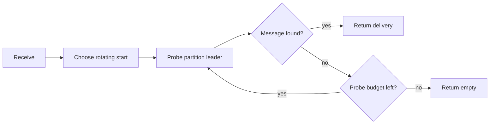

Consequently, an empty response means no message was found within the bounded
probe, not a linearizable proof that every partition is empty.

### ACK and NACK routing

An opaque authenticated receipt contains enough information to route directly:

```text
queueId
generationId
partitionId
messageId
deliveryAttempt
receiptNonce
integrity tag
```

The gateway does not scan partitions for ACK or NACK.

## 8. Multi-Raft queue-node architecture

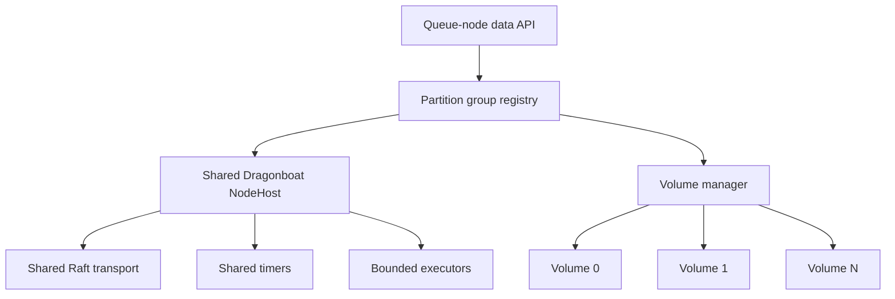

### Partition group registry

The registry maps `raftGroupId` to a lightweight runtime handle. It is
responsible for start, stop, lookup, local volume binding, and lifecycle
visibility. It is not the leader or commit authority.

### Shared resources

The design prohibits these per-group allocations by default:

- dedicated thread;
- dedicated scheduled executor;
- dedicated HTTP or gRPC client;
- dedicated connection pool;
- unbounded replication queue;
- unbounded metric label set.

Per-group state such as term, role, commit index, and follower progress remains
independent and may be held by Dragonboat.

### Group lifecycle

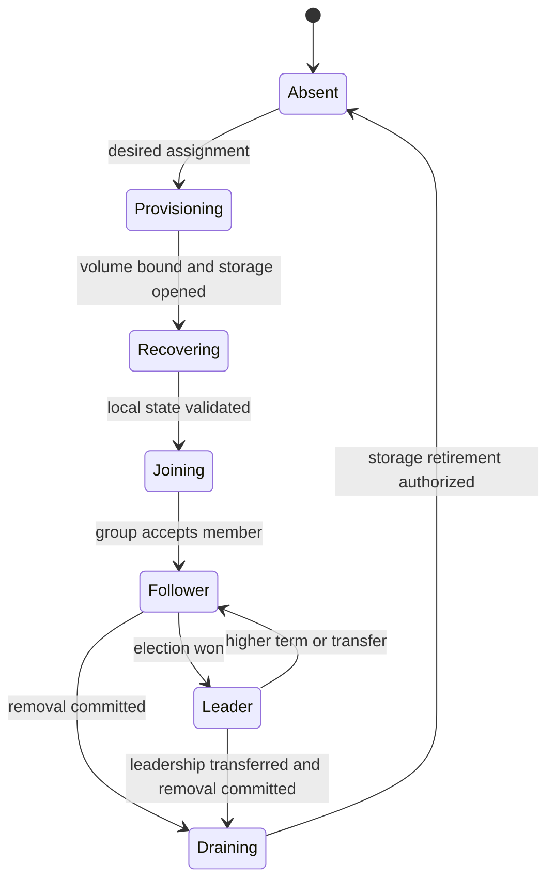

Initial bootstrap may create all empty voters from the immutable v0.29 member
set. Later replacement must use a learner until catch-up is proven.

### 8.1 Why Dragonboat is the leading candidate

Raft and stable-leader Multi-Paxos have the same steady-state message shape:
one replication request and acknowledgement per follower. The scalability
lever is not choosing Raft because it sends fewer messages. It is partitioning
the workload into many independent groups and operating those groups efficiently
inside one process.

Raft is preferred over a new Multi-Paxos implementation because its leader,
term, log-matching, election-safety, membership, and snapshot rules form a more
complete implementation contract, and maintained Go libraries exist. This is an
implementability and ecosystem decision, not a claim that Paxos is unsafe or
fundamentally slower.

Dragonboat is the leading candidate because it is a Go Multi-Raft host rather
than a single-group wrapper. It exposes the boundaries this project needs:

- application-owned state machines;
- shared `NodeHost` execution for many groups;
- pluggable Raft `ILogDB` storage and transport;
- snapshot and log lifecycle integration;
- Prometheus-oriented metrics and failure controls;
- no separate consensus service between queue replicas and their data.

That last point matters. If a queue node called an external etcd or ZooKeeper
cluster for every message decision, the write would cross two distributed
systems:

```text
client
  -> queue partition leader
      -> external coordination quorum
          -> queue replica storage
```

The external quorum would become a shared bottleneck and additional failure
dependency while still not applying queue commands or repairing partition
logs. An in-process Raft library keeps the consensus log beside the state it
protects.

#### Dragonboat is not accepted merely because it implements Multi-Raft

The real requirement is Multi-Raft, not one Raft group. With replication factor
three and a 100 ms heartbeat interval, 10,000 groups naively produce up to
200,000 group heartbeat messages per second before customer traffic. The
selected runtime must batch or coalesce work by physical peer, share bounded
executors, and avoid one thread or connection set per group.

Dragonboat's documented features do not by themselves prove this project's
required group density, shared multiplexed WAL, startup behavior, release
viability, or tenant fairness. Those properties require source review and
measurement.

#### Go candidates

| Candidate | Strength for this project | Unresolved concern |
|---|---|---|
| Dragonboat | Explicitly designed for many Raft groups; shared `NodeHost`; membership, snapshots, ReadIndex, backpressure, custom LogDB and transport boundaries | Release-line health, dependency maintenance, storage extension fit, and behavior at this project's target density require proof |
| etcd/raft | Stable deterministic consensus core with extensive production lineage, batching, flow control, and membership support | Deliberately omits disk and network I/O; this project would own Multi-Raft hosting, persistence, transport, and snapshot transfer |
| HashiCorp Raft | Mature Go replicated-state-machine API with storage and snapshot abstractions | High-density shared Multi-Raft operation is not its defining architecture and must be demonstrated rather than assumed |
| Custom Raft | Complete control over multiplexed WAL, scheduling, and failure behavior | Highest correctness and maintenance risk; consensus work would dominate queue-product work |
| External etcd/ZooKeeper | Mature coordination service and simple operational API to the application | Wrong authority boundary for per-message logs; extra network hop and global shared quorum |
| Apache BookKeeper | Purpose-built replicated ledgers and storage-node journals | Changes the system into a separate storage tier and still needs queue leader/state-machine integration |

etcd/raft is a required comparison because its narrow deterministic core offers
maximum storage and scheduling control. The comparison must price the missing
host runtime honestly; building those layers is core distributed-storage work,
not adapter glue. Project-owned ports prevent Dragonboat types from leaking into
queue semantics.

#### Selection matrix

The library decision must score measured evidence for:

1. safety features: pre-vote, current-term commit rule, durable vote, safe
   membership change, and stale-leader rejection;
2. group density: memory, threads, timers, file descriptors, and startup time
   for 1,000 and 10,000 idle groups where feasible;
3. physical-peer efficiency: heartbeat coalescing, shared connections, and
   bounded replication pipelines;
4. storage integration: explicit per-volume placement and support for a shared
   multiplexed WAL or a clean alternative;
5. snapshot capture, installation, cancellation, retry, and log reclamation;
6. learner bootstrap, promotion, removal, and leader transfer;
7. linearizable read support and clear leader rejection behavior;
8. backpressure and bounded pending bytes under disk and network stalls;
9. TLS, authentication hooks, metrics, tracing, and operational diagnostics;
10. supported Go toolchain, dependency footprint, license, release health, and
    security response;
11. deterministic fault testing and the ability to inject storage and transport
    failures;
12. throughput, p99 latency, failover time, and recovery interference.

The outcome can be Dragonboat, an etcd/raft-based host, or rejection of both.
Selecting Dragonboat before these results would be dependency preference, not
engineering evidence.

#### Consensus core boundary

Whichever library wins, preserve four conceptual layers inspired by the
handbook's state-machine model:

```text
QueueStateMachine
    deterministic apply, snapshot, and restore

ConsensusCore
    terms, votes, leader, log matching, commit

RaftStorage
    multiplexed volume WAL, per-group index, snapshot artifacts

RaftTransport
    authenticated peer communication and physical-peer batching
```

The application owns the first layer. The selected library owns the consensus
core. Storage and transport are either library-provided or adapted behind
explicit ports; neither may leak into queue-domain commands.

## 9. Deterministic queue state machine

### Responsibility split

```text
Current
  LocalMessageQueue
    validation + command creation + WAL + mutable state + recovery

Target
  QueueCommandService
    request validation and command creation

  RaftPartitionRuntime
    replicate, commit, apply, and leader authority

  QueueStateMachine
    deterministic command application

  QueueSnapshotCodec
    deterministic state capture and restore

  StandaloneLocalQueue
    optional existing WAL adapter for single-node mode and tests
```

### Command envelope

```text
QueueCommandEnvelope
  commandVersion
  queueId
  generationId
  partitionId
  commandId
  commandType
  commandPayload
```

`commandId` supports deterministic retry handling. Payload encoding must be
versioned, bounded, checksum protected by the owning log, and independent of Go
in-memory struct layout or unversioned `gob` encoding.

### Initial commands

```text
Publish(messageId, producerRequestId, payload)
StartDelivery(messageId, receiptHandle, attempt, leaseDeadline)
Acknowledge(messageId, receiptHandle)
NegativeAcknowledge(messageId, receiptHandle, availableAt)
ExpireDelivery(messageId, receiptHandle)
MoveToDeadLetter(messageId, expectedAttempt)
MakeDelayedReady(messageId, expectedAvailableAt)
```

The exact command set must be derived from semantics before implementation. A
command must carry every value required for deterministic replay. Applying a
command must not generate a UUID, read a local clock, perform network I/O, or
consult PostgreSQL.

### Query behavior

Mutations go through Raft. Read-only status may be served under one explicitly
selected consistency mode:

```text
LINEARIZABLE  -> leader confirms current quorum authority before reading
LEADER_LOCAL  -> leader-local state without an extra read barrier
STALE         -> any replica may answer and reports applied index
```

Customer receive is a mutation because it creates a durable delivery lease. It
cannot be served as a stale follower read.

## 10. Publish sequence

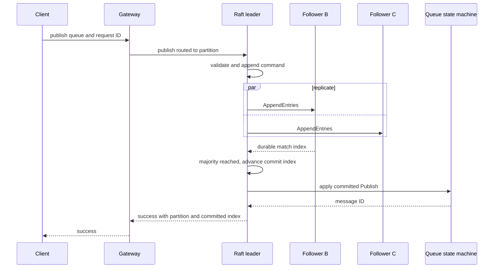

For replication factor three, leader plus either follower is a majority. The
leader must not acknowledge merely because it appended locally.

If the response is lost after commit, retry with the same producer request ID
must resolve to the same partition and return the already committed result.

## 11. Receive and delivery sequence

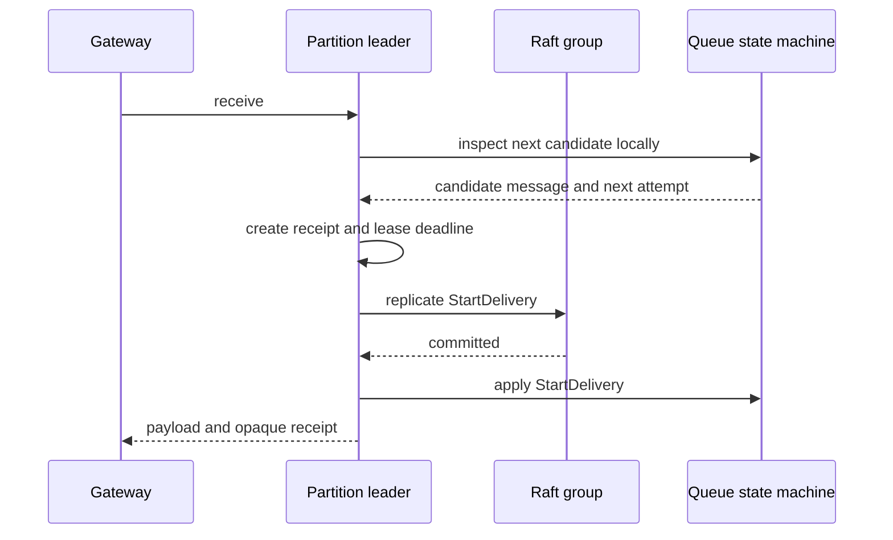

Candidate inspection does not expose a message. Only the committed
`StartDelivery` command removes it from ready state and creates the lease. The
apply step must verify expected message identity and attempt so a stale proposal
cannot lease a different head after leadership or retry races.

## 12. Time-driven transitions

Replicas do not mutate state merely because their local clocks pass a deadline.

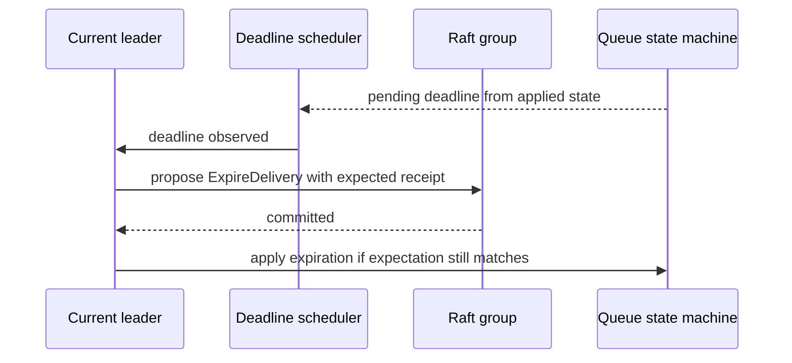

After election, the new leader rebuilds its deadline schedule from applied
state. Duplicate or obsolete timeout commands are deterministic no-ops or
explicit rejections according to the reviewed semantics.

Clock policy still matters for availability. The design must define maximum
tolerated clock uncertainty and whether a newly elected leader delays expiry to
avoid shortening a previously granted visibility lease.

## 13. Multi-volume storage

### Configuration shape

```yaml
queue:
  node:
    id: node-a
    failure-domain:
      region: ap-south
      zone: ap-south-1a
      rack: rack-07
      host: host-42
    storage:
      volumes:
        - id: nvme-00
          path: /mnt/nvme-00/distributed-queue
          storage-class: nvme
          maximum-used-percent: 85
          weight: 100
        - id: nvme-01
          path: /mnt/nvme-01/distributed-queue
          storage-class: nvme
          maximum-used-percent: 85
          weight: 100
```

The example is a proposed shape, not a frozen public configuration contract.

### Volume selection

For a new replica, select among healthy writable volumes using bounded capacity
and load observations. A reasonable initial policy is weighted least-used with
a deterministic volume-ID tie-break.

Do not derive the current location repeatedly from the active volume list. A
new disk would change the result and make existing storage appear missing.

### Durable binding and discovery

```text
assignment received
    -> scan configured volumes for matching lineage manifest
    -> if found, validate and reopen
    -> otherwise choose volume
    -> durably create replica manifest and storage
    -> publish observed volume binding
```

Every volume root contains self-describing replica directories. Recovery can
therefore rediscover replicas even if the metadata observation was not
published before a crash.

### Failure-domain rule

Placement first selects distinct eligible hosts and topology domains. The
chosen queue node then selects a local volume. Local disks influence capacity
and disk-failure recovery; they never satisfy host-level replica diversity.

### Disk failure

A failed volume transitions every hosted replica to unavailable. The node must
not start all recovery or snapshot transfers without limits. Recovery is
bounded per volume, node, remote leader, and tenant. Other volumes and groups
continue when their own invariants hold.

## 14. Metadata and Raft relationship

### Initial creation

```text
Metadata commits desired empty group and outbox event
        ↓
CDC projector publishes per-node assignments to etcd
        ↓
Assigned nodes receive watch events and provision local storage
        ↓
Bootstrap request creates the Dragonboat group
        ↓
All initial voters join the same configuration
        ↓
Raft elects a leader
        ↓
Nodes publish observed role and applied progress
        ↓
Queue becomes routable
```

`ACTIVE` must eventually mean more than “directories exist.” For a distributed
queue it should require an elected leader, a current quorum, and every required
bootstrap invariant. Exact activation semantics require review.

### Ongoing operation

Metadata stores a cached leader hint for routing and observation. That hint is
not authority. A node receiving a request verifies its Dragonboat role and term.

```text
stale gateway route
    -> contacted follower returns NOT_LEADER plus safe hint if known
    -> gateway refreshes route
    -> retry preserves producer request identity
```

### Metadata outage

An already established group continues when it has quorum. During the outage:

- existing leadership and message commit continue;
- no new queue or partition is provisioned;
- desired membership is not changed;
- failed replicas are not replaced from control-plane intent;
- cached routing may continue and `NOT_LEADER` redirects may repair it;
- administrative operations fail explicitly.

## 15. Threading and backpressure

### Required bounds

Bound at least:

- uncommitted commands and bytes per partition;
- pending commands and bytes per node;
- concurrent replication requests per peer;
- concurrent disk operations per volume;
- active snapshot creation and installation;
- restart recovery groups;
- tenant commands, bytes, and recovery traffic;
- receive probe count;
- executor queue lengths.

### Fairness

A hot tenant or recovering replica must not consume all node writers or network
permits. Initial scheduling may use weighted round-robin across tenant and
partition queues. Correctness must not depend on fairness, but availability of
unrelated tenants does.

### Overload behavior

Reject or throttle before accepting unbounded work:

```text
leader has quorum but pending bound reached -> retryable overload
leader lacks quorum                         -> unavailable, no false success
tenant quota exhausted                     -> tenant-scoped rejection
volume unhealthy                           -> affected replica unavailable
```

## 16. Recovery

### Replica restart

```text
locate stable volume binding
    -> validate lineage and group ID
    -> recover Dragonboat hard state, log, and snapshot
    -> restore QueueStateMachine snapshot
    -> replay committed suffix only
    -> join group as follower
    -> serve only after current Raft authority permits it
```

Uncommitted entries may exist after restart. They must not be applied merely
because they are locally durable. The current leader determines whether they
remain, are overwritten, or later commit.

### Node restart with many groups

Recovery must be staged. Opening every group and replaying every log at once can
exhaust file descriptors, heap, disk queue depth, and network bandwidth.

Suggested priority:

1. groups for which the node was recently leader and quorum needs it;
2. small or nearly recovered groups;
3. followers required to restore replication factor;
4. heavily lagging groups requiring snapshots.

The final policy requires measurement and must avoid permanent starvation.

## 17. Failure scenarios

| Scenario | Required behavior |
|---|---|
| Leader crashes before local append | No command exists; retry is safe with the same request ID |
| Leader crashes after local append but before majority | No success; next leader decides whether the uncommitted entry survives |
| Leader crashes after majority commit before response | Retry resolves to the already committed command result |
| Old leader receives writes after isolation | Cannot commit without quorum; rejects or times out, then steps down on higher term |
| Follower disk fails | Group continues with majority; replacement is control-plane work |
| Two disks fail on one host | Equivalent to one host failure for group diversity; affected local groups are independently unavailable |
| PostgreSQL unavailable | Existing quorate groups continue; placement and administration stop |
| Gateway caches old leader | Node rejects with `NOT_LEADER`; gateway refreshes and retries safely |
| Replica replays uncommitted suffix | Suffix remains unapplied until committed or is replaced by leader repair |
| Snapshot install interrupted | Previous authoritative state remains or installation resumes; partial snapshot is never promoted |
| Local clock moves forward | Only the leader may propose timeout commands; committed expectations prevent unrelated expiry |
| Local clock moves backward | Delivery may remain invisible longer; safety is preserved and observability reports skew |
| Volume configuration order changes | Existing manifests recover the same bindings; no silent remapping |
| One tenant overloads a node | Tenant and node bounds reject that work without unbounded memory growth |

## 18. Observability

Per node, expose bounded aggregate metrics:

- group count by local role and lifecycle state;
- leader count;
- election rate;
- commit latency histogram;
- replication batch bytes and latency;
- pending and uncommitted bytes;
- snapshot creation and installation duration;
- recovery queue depth;
- per-volume used bytes, pending writes, latency, and health;
- rejected work by stable reason code;
- metadata connectivity as control-plane health.

Per-group details belong in an on-demand diagnostic endpoint or sampled logs,
not automatically in metric labels for every tenant and partition.

Log low-volume authority transitions such as term change, election, leader
transfer, membership commit, snapshot installation, storage corruption, and
volume failure. Do not log every heartbeat, append, or customer payload.

## 19. Security boundaries

Before production claims:

- authenticate node-to-node Raft traffic;
- authorize group membership from committed configuration;
- encrypt transport;
- authenticate metadata and gateway calls;
- bind tenant identity at the gateway rather than trusting request payload;
- never log message payload, receipt handle, producer token, or credentials;
- protect local volumes and snapshots according to customer data policy.

Security is not delegated to Raft consensus. A correct consensus protocol over
unauthenticated peers is not a secure distributed queue.

## 20. Open review questions

1. Do we approve PostgreSQL outbox CDC to etcd as the control-plane distribution
   boundary?
2. Is direct lease-fenced observed-state publication to etcd acceptable, with
   PostgreSQL updated asynchronously for catalog visibility?
3. Should the Go CDC projector consume PostgreSQL logical replication through
   `pglogrepl`, or should an independently operated Debezium Server deliver
   events to the Go projector? Embedding Debezium in project-owned code is no
   longer an option.
4. What retained-WAL limit must stop administrative writes when the replication
   slot cannot advance?
5. Do we accept Go for all new project-owned control-plane and data-plane code,
   with Java retained only as a temporary semantic reference?
6. Do we accept Dragonboat as the leading candidate, conditionally on the
   proof-of-concept gates?
7. Should the Go runtime first evaluate Dragonboat's default LogDB, a custom
   multiplexed `ILogDB`, or both as explicit benchmark variants?
8. What partition-count default and upper bound should the first API expose?
9. Which stable hash algorithm and seed representation become durable routing
   contract?
10. Must queue creation wait for a Raft leader before becoming `ACTIVE`?
11. What exact event makes a majority acknowledgement durable under the selected
   Dragonboat LogDB configuration?
12. What clock-skew policy protects visibility-timeout expectations after leader
   change?
13. Is local volume binding authoritative only in the manifest, or also stored
   as desired metadata after provisioning?
14. What is the initial maximum number of groups, open files, and pending bytes
   per node?
15. Which queue semantics are supported across partitions: standard queue only,
   or strict message-group ordering in the first distributed version?
16. Do we require three failure domains at host level only, or zone awareness
   from the first production-oriented placement?
17. Which proof-of-concept result would cause us to choose a custom protocol or
   separate BookKeeper storage tier instead?

## 21. Review outcome required

The review should produce one of:

```text
APPROVE
  -> accept the event-driven control-plane target for the next milestone

REVISE
  -> update authority, partition, storage, or dependency decisions

REJECT
  -> retain the current architecture and document the alternative
```

Approval of the design selects the event-driven control-plane boundary. It does
not authorize implementation until the semantics, invariants, failure cases,
and tests for that boundary are reviewed.

## References

- [ADR 0029](../adr/0029-partitioned-multiraft-runtime.md)
- [Partition model](../architecture/appendix-a-partition-model.md)
- [Replication protocol](../architecture/appendix-b-replication-protocol.md)
- [Group commit and durability](../architecture/appendix-c-group-commit-and-durability.md)
- [Storage architecture](storage-architecture.md)
- [v0.29 replica-membership HLD](v0.29-replica-membership-hld.md)
- [Control Plane Architecture RFC](../architecture/Control_Plane_Architecture_RFC.md)
- [Dragonboat Multi-Raft](https://github.com/lni/dragonboat)
- [Dragonboat Raft log storage](https://github.com/lni/dragonboat/blob/master/docs/storage.md)
- [etcd Raft library](https://github.com/etcd-io/raft)
- [HashiCorp Raft](https://github.com/hashicorp/raft)
- [TiKV raft-rs](https://github.com/tikv/raft-rs)
- [The Rust Programming Language: Concurrency](https://doc.rust-lang.org/book/ch16-00-concurrency.html)
- [Effective Go: Concurrency](https://go.dev/doc/effective_go#concurrency)
- [etcd API: watches and leases](https://etcd.io/docs/v3.7/learning/api/)
- [ZooKeeper overview](https://zookeeper.apache.org/doc/current/zookeeperOver.html)
- [PostgreSQL logical decoding](https://www.postgresql.org/docs/17/logicaldecoding.html)
- [pglogrepl](https://github.com/jackc/pglogrepl)
- [Debezium Server](https://debezium.io/documentation/reference/operations/debezium-server.html)
