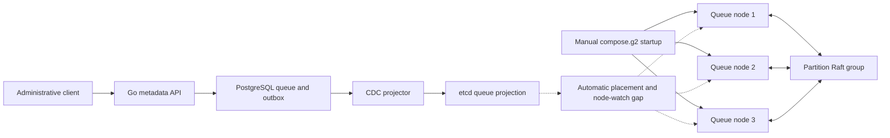
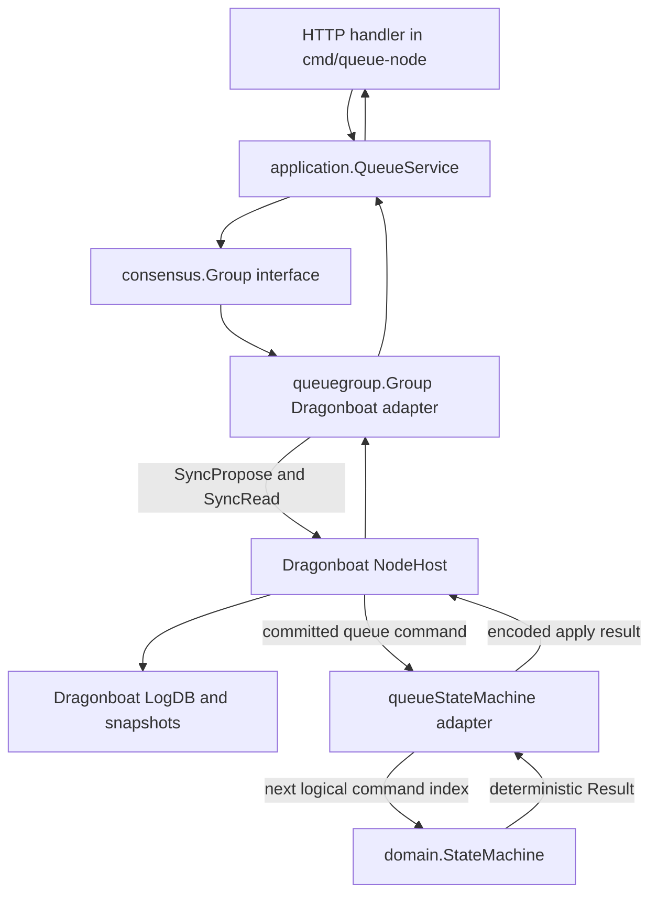
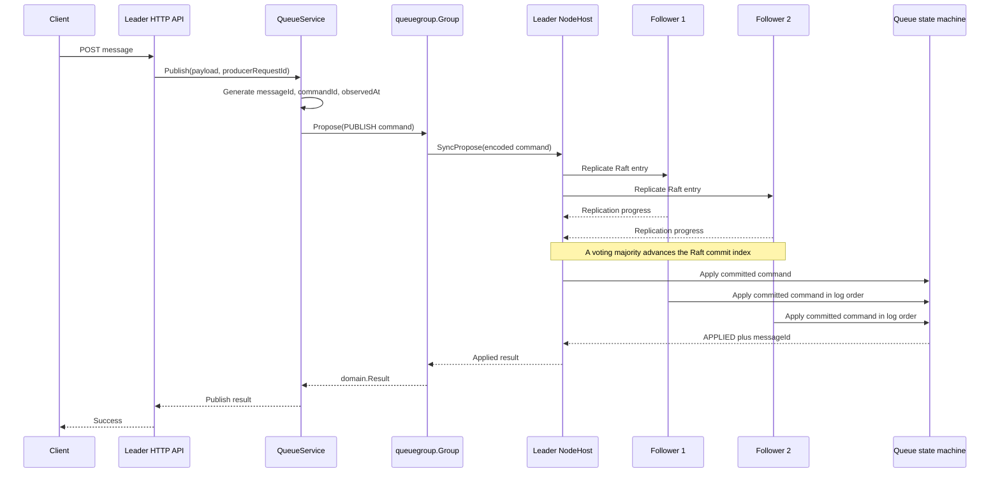
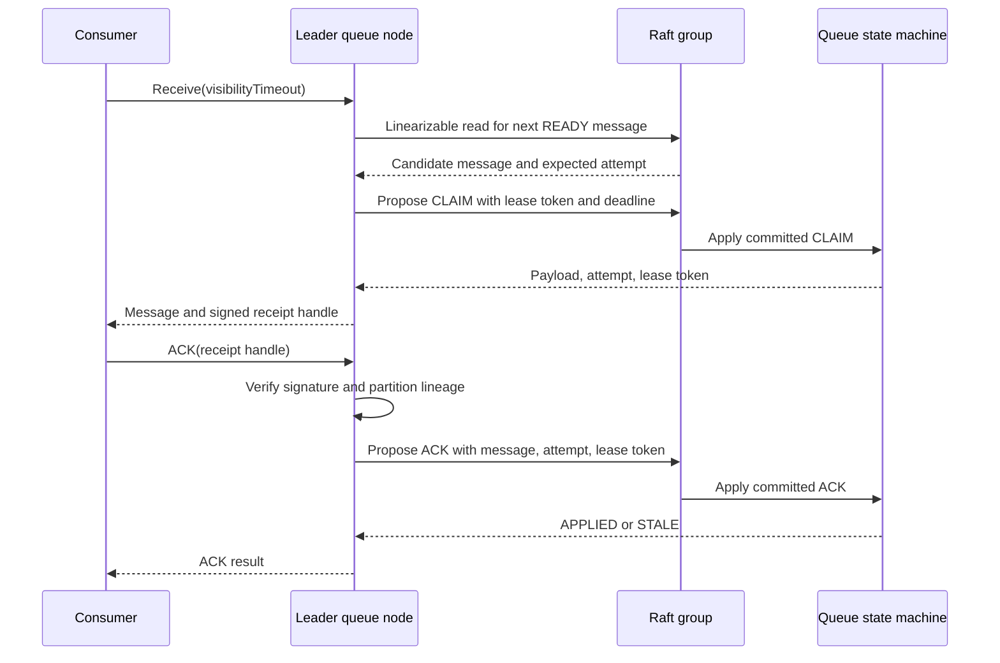
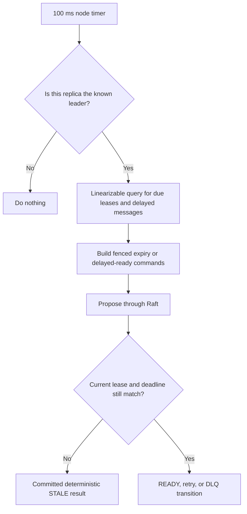
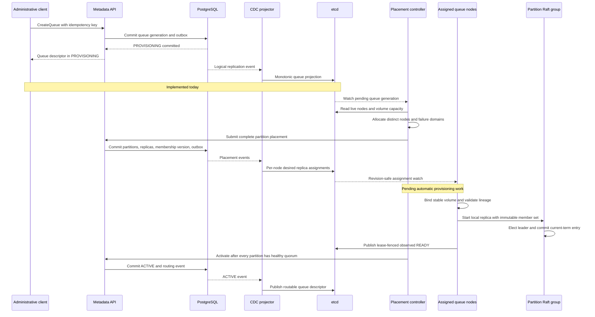
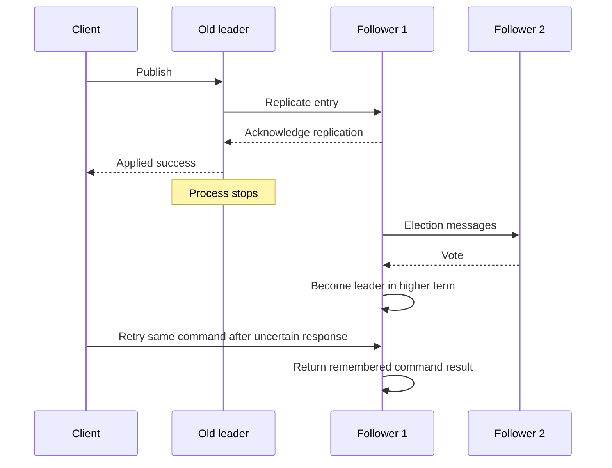

# G2 Queue Provisioning and Replication

This document connects the control-plane queue-creation code to the
experimental G2 Raft implementation. It separates what runs today from the
automatic provisioning path that still has to be built.

## 1. The most important boundary

Today, these are two working but disconnected paths:



The metadata API currently creates a durable queue generation in
`PROVISIONING` and projects it to etcd. The experimental G2 nodes currently
receive lineage, membership, and storage paths from command-line configuration.
Creating a queue through the API does **not** yet start its Raft groups.

## 2. Code path inside one experimental queue node



| Code | Responsibility |
|---|---|
| [queue_service.go](../../internal/dataplane/application/queue_service.go) | Builds publish, claim, ACK, NACK, expiry, and delayed-ready commands. It generates time and IDs before replication. |
| [group.go port](../../internal/dataplane/consensus/group.go) | Project-owned consensus boundary. Queue-domain code does not import Dragonboat. |
| [group.go adapter](../../tools/consensus-proof/queuegroup/group.go) | Converts commands to proposals, performs linearizable reads, decodes apply results, and owns one local replica. |
| [state_machine.go adapter](../../tools/consensus-proof/queuegroup/state_machine.go) | Adapts Dragonboat callbacks to deterministic queue apply, snapshot, and restore. |
| [domain state_machine.go](../../internal/dataplane/domain/state_machine.go) | Authoritative queue transition rules. It does not read clocks, generate IDs, or perform I/O. |
| [queue-node main.go](../../tools/consensus-proof/cmd/queue-node/main.go) | Starts one replica process, exposes HTTP, and runs leader-only due-transition cycles. |

## 3. Why the queue index is not the Raft index

Dragonboat's log contains entries that are not queue commands. Passing the Raft
index directly to the queue domain would create a false command gap.

```text
Raft log index 1: initial membership       no queue index
Raft log index 2: internal Raft entry      no queue index
Raft log index 3: PUBLISH                  queue index 1
Raft log index 4: CLAIM                    queue index 2
Raft log index 5: ACK                      queue index 3
```

`queueStateMachine.Update` therefore applies each delivered queue command at
`LastAppliedIndex + 1`. Raft owns consensus indexes and terms; the queue domain
owns its contiguous command index.

## 4. Publish replication



The three apply arrows show eventual per-replica application; their vertical
order in the drawing does not require followers to apply after the leader.

Important details:

1. IDs and time are generated before the proposal and become part of the
   replicated command. Followers never read their own clocks during apply.
2. The client result is produced by deterministic apply, not by the PostgreSQL
   control plane or etcd.
3. A follower may apply slightly later than the leader. Majority completion
   does not mean every follower has already applied the entry.
4. G2 proves quorum behavior and restart recovery. The exact power-loss
   durability boundary of the deferred Dragonboat v4 revision remains
   unapproved by ADR 0031.

## 5. Receive and ACK are also replicated writes



The read only chooses a candidate. The message is not delivered until `CLAIM`
is committed. ACK and NACK carry the delivery attempt and lease token, so an old
consumer cannot mutate a newer delivery.

## 6. Lease expiry and delayed retry



The timer is not authority. It only proposes facts containing the expected
lease identity and deadline. Committed queue state decides whether the proposal
is still valid.

## 7. Target automatic provisioning after CreateQueue

The following flow is the target architecture. Steps marked **implemented**
already have executable Go code. Steps marked **pending** are the connection
between the control plane and G2.



### Durable state after each stage

```text
CreateQueue committed
  PostgreSQL: queue generation = PROVISIONING, outbox event
  etcd:       eventually receives the queue projection
  data plane: no Raft group yet

Placement committed
  PostgreSQL: partition IDs, Raft group IDs, replica IDs, desired nodes
  etcd:       eventually receives per-node desired assignments
  data plane: assigned nodes may begin idempotent local provisioning

Replica provisioning complete
  local disk: Dragonboat LogDB, snapshot directory, bootstrap membership
  etcd:       lease-fenced observed READY for each live replica
  data plane: Raft leader and voting quorum exist

Queue ACTIVE
  PostgreSQL: authoritative lifecycle is ACTIVE
  etcd:       routable projection and leader hints
  gateway:    may send customer traffic to the partition leader
```

`202 Accepted` or a `PROVISIONING` response means only that queue metadata was
committed. It must never be interpreted as “the replicated queue is ready.”

## 8. What must be implemented to connect creation to G2

```mermaid
flowchart LR
    ExistingCreate["Existing queue create and outbox"] --> NeedPartitions["Create durable partition intents"]
    NeedPartitions --> NeedController["Placement controller"]
    NeedController --> NeedEvents["Placement outbox events"]
    NeedEvents --> NeedProjection["Per-node etcd desired assignments"]
    NeedProjection --> NeedWatch["Revision-safe queue-node watcher"]
    NeedWatch --> ExistingG2["Existing G2 replica Start"]
    ExistingG2 --> NeedObserved["Lease-fenced observed readiness"]
    NeedObserved --> NeedActivation["Quorum-aware ACTIVE transition"]
    NeedActivation --> NeedRouting["Gateway route publication"]
```



The placement function already exists, and the SQL schema already contains
partition and replica tables. What is missing is the controller and transaction
workflow that turns those building blocks into durable placement intent and
then drives the queue-node watcher.

## 9. Leader failure



The queue's bounded command-result history makes retry after an ambiguous
response idempotent. This is not unlimited deduplication; callers must retry
within the configured retention bound.
